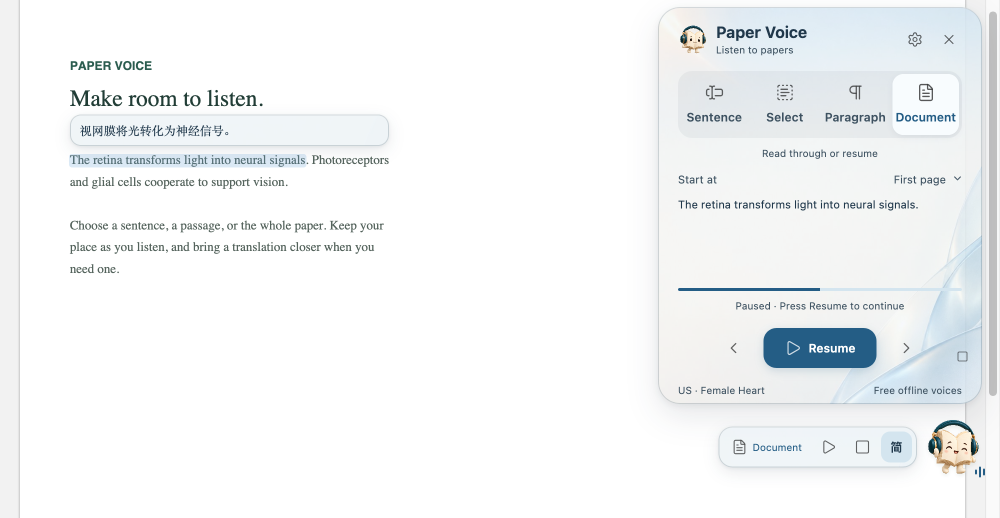

<a href="README.md">简体中文</a> · <b>English</b>

<h1 align="center">Your papers, read aloud.</h1>

Listen in Zotero, follow the original, and bring a translation along. Focus on one sentence or keep listening through a paper.

<b>Free and open source · Offline voices · Source highlighting</b>

<a href="#download-and-install">Download and install</a> · <a href="docs/GUIDE.en.md">Illustrated guide</a> · <a href="https://github.com/JunyanKang/paper-voice/issues">Report an issue</a>

## Read at your own pace

Replay a difficult sentence or keep moving through a familiar passage. Four modes give you control over how much to hear.

| What you want to hear | Mode | How to begin |
|---|---|---|
| One complete sentence | **Sentence** | Select any word in it |
| A specific passage | **Select** | Select exactly the text you want |
| A complete argument | **Paragraph** | Select text anywhere in the paragraph |
| The paper continuously | **Document** | Start at the beginning, current page, selected sentence or last position |

Sentence, selection and paragraph modes support repeat playback. Your latest reading position is saved, so you can resume after restarting or updating.

## Keep your place as you listen

The current source sentence is highlighted, with scrolling, column changes and page turns following the reading. Floating controls keep pause, replay and navigation close without leaving the panel open.

Paper-specific text processing skips recognizable citation markers, figure captions and publication details while preserving meaningful figure references in the prose. Common units, ratios, superscripts and subscripts are prepared for speech. **Your PDF and annotations stay unchanged.**

## See a translation—or listen to it

- **Translate a selection.** See the translation beside the text. Choose a selection, sentence or paragraph; partially selected words in languages such as English are completed for translation.
- **Follow translated text.** Translations stay near the sentence being read, adapt to its text region, and can appear above or below it.
- **Listen to the translation.** Switch the audio to the translated text while the original stays highlighted and in view.

Choose **Tencent, Microsoft or Google**, or connect your own LLM API, including **MiniMax, DeepSeek, Qwen, OpenAI, Claude and Gemini**. [Connect a service →](docs/GUIDE.en.md#llm-translation)

**4 spoken languages, 14 offline voices.** Listen in English, Mandarin Chinese, Japanese or French, with automatic language detection and manual selection. English includes US/UK accents and male/female voices. Translated audio supports the same four languages.

**9 translation targets, 5 interface languages.** Written translations include Simplified and Traditional Chinese alongside other languages. The interface supports Chinese, English, Japanese, French and German. [Explore languages and voices →](docs/GUIDE.en.md#choose-a-language-and-voice)

## Make it part of your reading routine

Press **Space** to pause or resume, **↑ / ↓** for the previous or next sentence, and **Esc** to stop. Customize shortcuts with conflict detection. [All shortcuts →](docs/GUIDE.en.md#keyboard-shortcuts)

Choose from 10 themes, import a background, adjust transparency, and use fonts installed on your computer for translated text. The book mascot adds occasional interactions; you can turn them off in Settings.

## Download and install

For **Zotero 10**. On your first installation, choose the complete ZIP package for your system under **Assets** on the release page. It includes the plugin, offline voices and installer.

**[Download for Windows →](https://github.com/JunyanKang/paper-voice/releases/latest)** 
Intel / AMD 64-bit computers · Choose the ZIP with `Windows-x64` in its name

**[Download for Mac →](https://github.com/JunyanKang/paper-voice/releases/latest)** 
Apple Silicon (M series), macOS 14 or later · Choose the ZIP with `macOS-arm64` in its name

1. **Install voices.** Extract the entire ZIP, open the installer, and select Install voices. Wait for Voices ready.
2. **Add the plugin.** In Zotero, go to Tools → Plugins → gear → Install Plugin From File, then select the included `.xpi`.
3. **Start listening.** Open a PDF with selectable text and select a passage. Click the book mascot to adjust the mode, voice and translation.

The package includes the voices and their runtime; no separate Python installation is needed. Scanned PDFs need text recognition first.

**[Open the illustrated guide →](docs/GUIDE.en.md)** · [Installation help](docs/INSTALL.en.md) · [Other platforms and compatibility](docs/COMPATIBILITY.en.md)

Already using Paper Voice? Check for updates in Settings or install the latest `.xpi`. See the [upgrade guide](docs/GUIDE.en.md#how-do-i-update) to check whether your voice pack needs replacing.

## Cost and privacy

**The plugin and offline speech are free, with no subscription or API key required.** Speech is generated on your computer. Turn off translation to listen to the original entirely offline.

Translation needs internet access, and selection translation is on by default. Only the text needed for translation is sent to your chosen service—not the entire PDF or library. You can turn this off in Settings. Optional LLM translation uses your own API key; provider fees apply. [Privacy details →](PRIVACY.md)

---

[User guide](docs/GUIDE.en.md) · [Common questions](docs/GUIDE.en.md#updates-and-common-questions) · [Feedback](https://github.com/JunyanKang/paper-voice/issues) · [Acknowledgments](docs/ACKNOWLEDGMENTS.md)

Created by [Junyan Kang](https://github.com/JunyanKang) · [MIT License](LICENSE)
