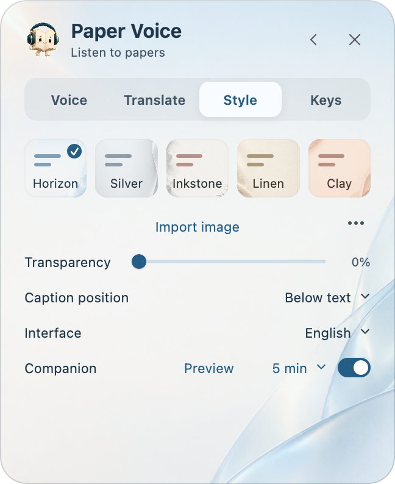
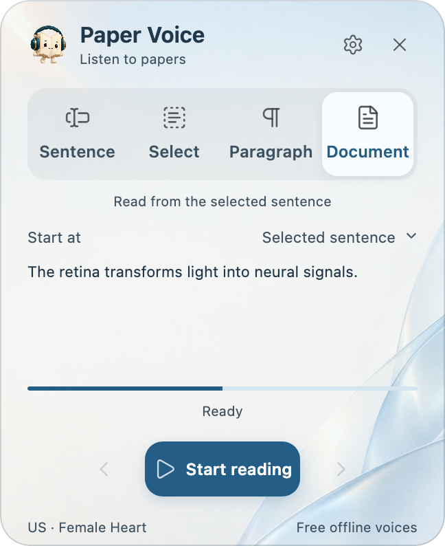
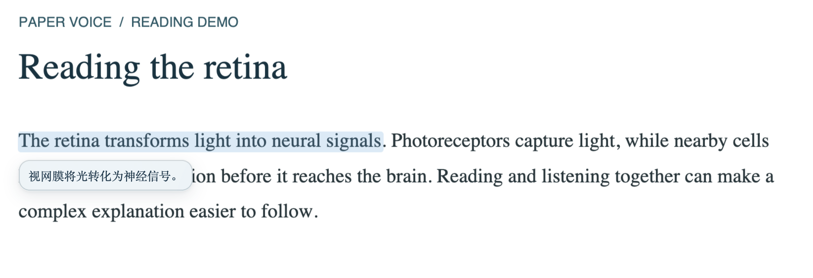
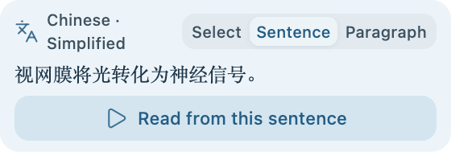

<h1 align="center">Make room to listen.</h1>

Listen to papers, follow the text, and bring translation closer — inside Zotero.

<a href="README.md">简体中文</a> · <b>English</b>

<b>Free & open source · Offline voices · Follow-along highlighting</b>

<a href="https://github.com/JunyanKang/paper-voice/releases/latest">Download</a> · <a href="docs/INSTALL.en.md">Installation</a> · <a href="docs/GUIDE.en.md">User guide</a>

Paper Voice adds natural speech and nearby translations to Zotero's PDF reader. Listen closely to a difficult sentence or continue through a paper, with the words you are hearing kept in view.

## Made for reading papers

- **A clearer listening flow.** Skips recognizable citations, headers, footers and captions, and improves readings of units, ratios and scripts. Your PDF and annotations stay unchanged.
- **A voice that suits you.** Automatic language detection and 14 offline voices, including US and UK English with male and female options.
- **Your reading space.** Customize shortcuts, themes and caption fonts. Open the panel when needed; it folds away when you return to the PDF.

Appearance settings in one place; only the controls you need while reading.

## One sentence, or the whole paper

Select a word to hear its full sentence or paragraph. Read just a selection, or continue from a chosen sentence. Repeat sentences, selections and paragraphs, and return to your latest position after restarting or updating.

Four modes let you choose how much to hear.

The page follows your place across columns and pages. Press **←** to repeat a sentence, **↓** to move forward, or **Space** to pause and resume. The floating controls also offer sentence and paragraph navigation.

Actual interface · The current sentence stays highlighted with its translation nearby. Sample text for demonstration.

## Translation, close to the text

**Select to translate**, then choose a selection, sentence or paragraph as the scope. During playback, captions follow the current sentence. Turn on **Read translation** to hear only the translation while the original remains highlighted.

Choose a scope, read its translation, then start listening here.

Choose Tencent, Microsoft or Google, or connect your own model API. Several translation targets are available; English, Chinese, Japanese and French have offline voices. [Translation and API setup →](docs/TRANSLATION.en.md)

## Download and install

For **Zotero 10**. Install and open Zotero first, then get the installer for your computer from the [official release page](https://github.com/JunyanKang/paper-voice/releases/latest).

<table align="center">
<thead>
<tr>
  <th align="center">Windows</th>
  <th align="center">macOS</th>
</tr>
</thead>
<tbody>
<tr>
  <td align="center"><strong>EXE installer</strong></td>
  <td align="center"><strong>DMG installer</strong></td>
</tr>
<tr>
  <td align="center">Intel / AMD x64</td>
  <td align="center">Apple Silicon · macOS 14+</td>
</tr>
</tbody>
</table>

1. **Prepare voices:** open the installer and select Download & install. The plugin and voices are downloaded as needed.
2. **Enable the plugin:** quit Zotero when prompted. Setup installs into your selected profile; on first launch, enable Paper Voice under Tools → Plugins.
3. **Start listening:** open a PDF with selectable text, select a passage, and use the book character to choose a reading mode.

[Installation steps, custom locations and upgrades →](docs/INSTALL.en.md)

## Free to listen. Local by design.

The plugin and offline narration are free, with no subscription or API key required. Download voices once, then listen locally. Scanned PDFs need OCR first.

Translation needs internet access; selection translation is enabled by default. Only text needed for translation is sent, not your PDF or library. Optional model APIs use your own key and may incur provider charges. [Data and privacy →](PRIVACY.en.md)

## Documentation and support

<table align="center">
<thead>
<tr>
  <th align="center">I want to…</th>
  <th align="center">Read</th>
</tr>
</thead>
<tbody>
<tr>
  <td align="center">Install, update or move voices</td>
  <td align="center"><a href="docs/INSTALL.en.md">Installation</a></td>
</tr>
<tr>
  <td align="center">Use modes, navigation and shortcuts</td>
  <td align="center"><a href="docs/GUIDE.en.md">User guide</a></td>
</tr>
<tr>
  <td align="center">Configure translation or a model API</td>
  <td align="center"><a href="docs/TRANSLATION.en.md">Translation guide</a></td>
</tr>
<tr>
  <td align="center">Check platform support and limits</td>
  <td align="center"><a href="docs/COMPATIBILITY.en.md">Compatibility</a></td>
</tr>
<tr>
  <td align="center">Contribute to development</td>
  <td align="center"><a href="docs/BUILD.md">Build and release</a></td>
</tr>
</tbody>
</table>

Report problems or suggestions in [Issues](https://github.com/JunyanKang/paper-voice/issues), including your operating system, Zotero version and steps to reproduce.

Created by <a href="https://github.com/JunyanKang">Junyan Kang</a> · <a href="LICENSE">MIT License</a> · <a href="docs/ACKNOWLEDGMENTS.md">Acknowledgments</a>

