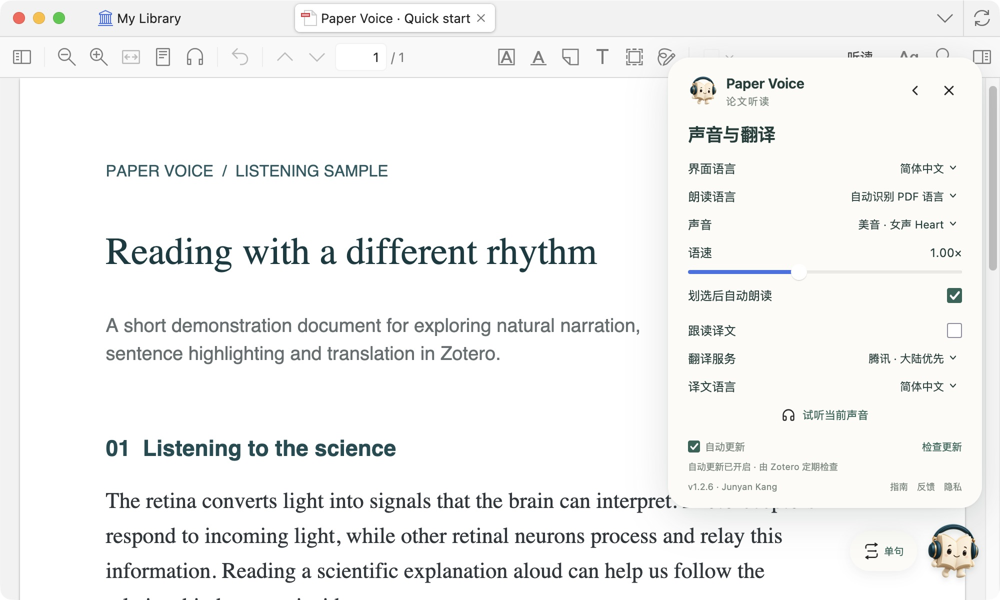

<b>简体中文</b> · <a href="README.en.md">English</a>

<h1 align="center">让论文，读给你听。</h1>

在 Zotero 中听论文，让目光跟随声音，让译文贴近原文。

免费使用 · 四种语言 · 离线语音 · 中文与英文界面

<a href="#下载">下载</a> · <a href="#快速开始">快速开始</a> · <a href="#使用指南">使用指南</a> · <a href="#常见问题">常见问题</a>

## 下载

第一次使用，请下载与你的电脑匹配的完整包。安装助手、离线声音和 Zotero 插件都已包含在内。

**Windows · Intel / AMD 64 位电脑**

[下载 Windows 完整包 →](https://github.com/JunyanKang/paper-voice/releases/download/v1.2.8/Paper-Voice-1.2.8-Windows-x64.zip)

**Mac · Apple 芯片（M 系列），macOS 14 或更新版本**

[下载 Mac 完整包 →](https://github.com/JunyanKang/paper-voice/releases/download/v1.2.8/Paper-Voice-1.2.8-macOS-arm64.zip)

已安装 Paper Voice？在插件设置中点击 **检查更新**，或[下载插件文件 `.xpi`](https://github.com/JunyanKang/paper-voice/releases/download/v1.2.8/paper-voice-1.2.8.xpi)。

适用于 Zotero 10。[查看版本记录](CHANGELOG.md) · [查看兼容性说明](docs/COMPATIBILITY.md)

## 快速开始

### 1. 安装离线声音

完整解压下载的 ZIP，打开 **Paper Voice 安装助手**，选择中文或 English，然后点击 **安装声音**。第一步右侧出现绿色的 **✓ 声音已就绪**，就可以进入下一步。

Windows 请将安装助手与 `Resources` 文件夹放在一起。Mac 的声音资源已包含在安装助手中。

### 2. 将插件添加到 Zotero

在 Zotero 中打开 **工具 → 插件 → 右上角齿轮 → 从文件安装插件**，选择完整包里的 `paper-voice-1.2.8.xpi`。

英文菜单对应 **Tools → Plugins → Install Plugin From File**。[需要更详细的安装帮助？](docs/INSTALL.md)

### 3. 开始第一次听读

打开一篇可以选中文字的 PDF，插件会 **自动识别原文语言**，**拖选文字，松开鼠标即可开始朗读**。点击右下角的书页精灵，可展开播放面板；点击面板右上角的 ×，即可收起。

从右下角的书页精灵进入。图标上的底色表示当前模式，循环次数可按需调整。

## 使用指南

### 选择想听的范围

四个模式按 **单句 → 划选 → 段落 → 全文** 排列。点击图标切换；悬浮工具栏上的模式按钮也按这个顺序轮换。

朗读时，将鼠标移到悬浮栏的**模式按钮**，即可展开句段导航。全文和段落模式分别提供「句子」「段落」两行，每行都有上一项、重读和下一项；单句模式只显示句子导航。移出后面板自动收起，暂停、停止与译文始终保留在栏中。键盘聚焦模式按钮后，按 ↑ / ↓ 进入导航，按 Enter 执行。

句子跳转不会更改阅读模式：全文继续向后读；段落从目标句读到段末，下一遍循环仍读完整段落。

- **单句**：选中句中的任意文字，就会从句首读完整句，用「上一句／重读当前句／下一句」逐句精听。
- **划选**：只读鼠标选中的内容，适合快速听一个词、一句话或一段论述。
- **段落**：选中段中的任意文字，就会从段首读完整段落，用「上一段／重读当前段／下一段」浏览相邻段落。
- **全文**：从指定位置连续读到文末；可按句子或段落移动，跳转后继续连读。

单句、划选和段落都可以选择 **1 次、2 次、3 次、5 次或持续循环**。

播放中切换模式，当前音频会保持连贯：全文切到单句或段落，会读完当前句或段落再停；切到全文，会从当前位置继续往下读。

### 从想听的位置继续

全文模式提供四种起点：**第 1 页、当前页、上次进度、选定位置（句首）**。

想从某句话开始，先选择 **从选定位置（句首）**，再划选其中的字母、单词或整句，点击 **从此句开始连读**。选择 **从上次进度**，则会回到这篇 PDF 最近一次实际朗读的位置，无论上次使用的是哪种模式。

高亮指向当前朗读片段，译文显示在原句附近。收起面板后，浮动工具栏仍可控制播放。

页面会随朗读滚动、换栏和翻页。全文播放时，普通点击或手动滚动不会打断朗读；需要跳转时，使用导航按钮即可。

### 自然读出科研单位

常见计量符号会按朗读语言展开，例如 `10 μm`、`2 mg`、`37 °C`、`45°` 和 `5 mg/kg`。同时支持数值范围、正负号、平方／立方和科学计数法。原文、高亮和译文仍保留论文中的写法。

### 用键盘控制播放

- **空格**：暂停，再按一次继续。
- **Esc**：停止朗读，同时清除高亮和译文。
- **Option / Alt + P**：暂停或继续。
- **Option / Alt + T**：显示或隐藏译文。

在 PDF 阅读区域使用快捷键。在搜索框或笔记中打字时，空格保持正常输入。

### 选择声音，开启译文

点击面板右上角的 **设置** 图标。**朗读语言** 默认选择「自动识别 PDF 语言」，也可手动指定。选择声音后点击 **试听当前声音**，找到适合自己的音色。语速可在 **0.60–1.60×** 之间调整，声音和语速的修改会在下次开始朗读时生效。

朗读语言、界面语言和译文语言分别设置，听读与翻译可以自由搭配。

**美式英语**：女声 Heart、Bella；男声 Michael、Fenrir。 
**英式英语**：女声 Emma；男声 George。 
**中文（普通话）**：默认男声 **Yunxi**；可选男声 Yunjian、女声 Xiaobei 和 Xiaoxiao。 
**日语**：默认女声 **Tebukuro**；可选女声 Alpha、男声 Kumo。 
**法语**：女声 Siwis。

自动识别在本机完成，无需联网。短词会参考所在 PDF 的正文；混合语言段落可自动切换音色。无法确定或遇到尚不支持的语言时，会提示手动选择。每种语言会记住上次使用的声音。切换语言后，点击试听可听到对应语言的示例。

开启 **跟读译文**，翻译就会显示在正在朗读的原句附近。它只显示译文，不会额外朗读译文。默认使用腾讯，也可选择微软或 Google；Google 需要网络可达，繁体中文请使用微软或 Google。

悬浮工具栏的译文按钮会显示目标语言标记：**简／繁／日／한／FR／DE／ES／RU**。**单击**按钮，依次切换当前翻译服务支持的语种；**双击**关闭译文。关闭后单击会切到下一种语言并重新显示。底色表示是否开启，Option / Alt + T 仍可直接开关译文。

译文支持简体中文、繁体中文、日语、韩语、法语、德语、西班牙语和俄语。界面可独立选择 **简体中文、English 或跟随系统**。

截图使用 macOS 上的 Paper Voice 1.2.6 和专门制作的演示文档。Windows 使用相同的插件控件；系统菜单外观可能不同。点击图片可查看大图。

## 常见问题

<b>语音需要联网、付费或另外安装 Python 吗？</b>

不需要。完整包自带 Kokoro 离线语音引擎、模型和运行环境，安装后由本机生成语音，不使用系统自带的朗读声音，也无需语音订阅或 API 密钥。翻译和插件更新需要联网。

<b>为什么有些文献标记没有读出来？</b>

Paper Voice 会略过可识别的数字引文、作者年份、图表引用、可识别的图注和出版信息，让正文听起来更连贯。它只处理用于朗读的文字，不会修改 PDF 或批注。

<b>划选后没有声音，先检查什么？</b>

先确认 PDF 能选中文字；扫描件需要先进行 OCR。然后在设置中点击「试听当前声音」，确认声音已安装，并检查电脑的音量与输出设备。若关闭了「划选后自动朗读」，选中文字后需要点击播放。

<b>更新时需要重新下载完整包吗？</b>

**升级到 1.2.6 的多语言声音，需要重新下载完整包并安装声音一次。** 原来的英文声音包仍可使用。之后的常规插件更新，在设置中点击「检查更新」，或安装最新的 `.xpi` 即可。除发布说明另有提示外，原有声音包可以继续使用。`updates.json` 由插件自动使用，无需手动下载。

---

[安装帮助](docs/INSTALL.md) · [兼容性说明](docs/COMPATIBILITY.md) · [隐私说明](PRIVACY.md) · [反馈问题](https://github.com/JunyanKang/paper-voice/issues)

Created by [Junyan Kang](https://github.com/JunyanKang) · [MIT License](LICENSE)

语言识别使用 <a href="https://github.com/komodojp/tinyld">TinyLD</a>；中日文发音使用 <a href="https://github.com/hexgrad/misaki">Misaki</a> 与随包词典；语音由 <a href="https://github.com/thewh1teagle/kokoro-onnx">Kokoro ONNX</a> 与 <a href="https://huggingface.co/hexgrad/Kokoro-82M">Kokoro-82M</a> 提供；图标来自 <a href="https://lucide.dev">Lucide</a>；翻译适配参考 <a href="https://github.com/windingwind/zotero-pdf-translate">Translate for Zotero</a>。
