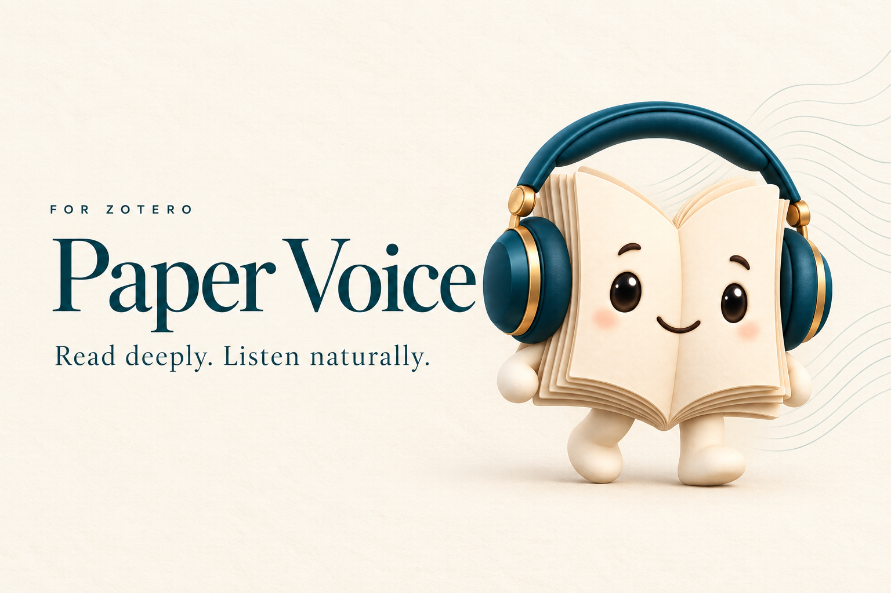

  

<h1 align="center">让论文，读给你听。</h1>

  在 Zotero 中，用自然的声音听英文论文。 
  划选即读，译文随行，让注意力回到内容本身。

  <a href="https://github.com/JunyanKang/paper-voice/releases/latest"><b>下载 Paper Voice</b></a> ·
  <a href="docs/INSTALL.md">安装指南</a> ·
  <a href="docs/GUIDE.md">使用指南</a> ·
  <a href="https://github.com/JunyanKang/paper-voice/issues">反馈与建议</a>

免费使用 · 离线声音 · 美音 / 英音 · Windows / macOS · Zotero 10

 

## 阅读，有了另一种节奏

**选中，便开始。** 一个句子、一段论述，鼠标轻轻划选，即刻进入听读。悬浮精灵随手可及，控制面板按需展开。

**从一句，听到整篇。** 从首页、当前页、最近进度，或你刚刚选中的那一句开始。随朗读高亮、滚动与翻页，让目光自然跟上声音。

**理解，紧随原文。** 译文浮现在当前原句附近，跨栏、跨页也随之移动。默认腾讯翻译，也可选择微软或 Google，并切换八种译文语言。

**把难句，听得更清楚。** 段落循环、单句精听，配合六种英文声音与可调语速。常见文献标记和图表引用会在朗读时略过，让句子更连贯。

 

## 你的声音，你的节奏

| | 美式英语 | 英式英语 |
|:--|:--|:--|
| 女声 | Heart · Bella | Emma |
| 男声 | Michael · Fenrir | George |

声音在电脑本地运行。无需订阅、无需语音额度、无需 API 密钥。安装一次，即可离线听读。

 

## 三步，开始听读

**1 · 下载** 
在 [最新版本](https://github.com/JunyanKang/paper-voice/releases/latest) 中，选择适合电脑的完整安装包。

| Windows | Mac |
|:--|:--|
| [下载 Windows x64 完整包](https://github.com/JunyanKang/paper-voice/releases/download/v1.2.4/Paper-Voice-1.2.4-Windows-x64.zip) | [下载 Apple Silicon 完整包](https://github.com/JunyanKang/paper-voice/releases/download/v1.2.4/Paper-Voice-1.2.4-macOS-arm64.zip) |
| Intel / AMD 64 位电脑 | M 系列芯片 · macOS 14 或更新版本 |

**2 · 安装** 
完整解压，打开 **Paper Voice 安装助手**，点击「安装声音」。随后在 Zotero 的插件管理器中，选择「从文件安装」，添加下载包里的 `.xpi` 文件。

**3 · 聆听** 
打开一篇英文 PDF，划选文字。点击右下角的书页精灵，选择声音、阅读模式，或开启随行译文。

[查看图文安装指南 →](docs/INSTALL.md)

**已经安装？** 在插件设置中点击「检查更新」即可。日常更新只需插件，无需重复下载声音包。

 

## 为专注而设计

四种阅读模式，覆盖浏览、通读与精读。小巧的悬浮控制、柔和的句子高亮，以及紧贴原文的译文，让工具留在视线边缘，让内容处于中心。

声音合成在本地完成；翻译由你主动开启。文献、PDF 与批注保持原样。

[使用指南](docs/GUIDE.md) · [兼容性与使用说明](docs/COMPATIBILITY.md) · [隐私说明](PRIVACY.md) · [版本记录](CHANGELOG.md)

---

   
  <b>Paper Voice</b> 
  Created by <a href="https://github.com/JunyanKang">Junyan Kang</a> · <a href="LICENSE">MIT License</a>

Built with <a href="https://github.com/thewh1teagle/kokoro-onnx">Kokoro ONNX</a>, <a href="https://huggingface.co/hexgrad/Kokoro-82M">Kokoro-82M</a> and <a href="https://lucide.dev">Lucide</a>. 翻译适配参考 <a href="https://github.com/windingwind/zotero-pdf-translate">Translate for Zotero</a>。

