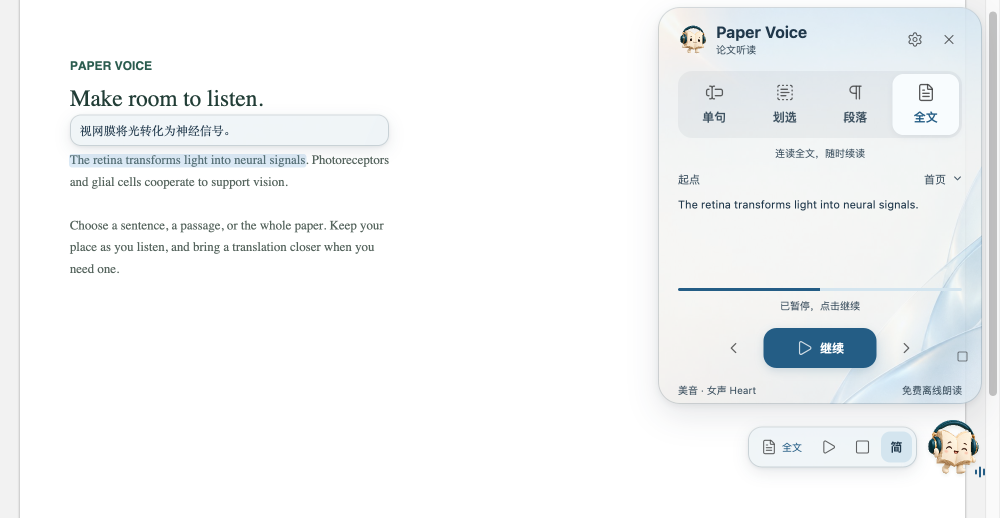

<b>简体中文</b> · <a href="README.en.md">English</a>

<h1 align="center">论文，也可以听。</h1>

在 Zotero 里听论文，跟着原文理解，也让译文随行。 从精听一句，到连续读完一篇。

<b>免费开源 · 离线声音 · 原文随读高亮</b>

<a href="#下载与安装">下载与安装</a> · <a href="docs/GUIDE.md">图文使用指南</a> · <a href="https://github.com/JunyanKang/paper-voice/issues">反馈问题</a>

## 按自己的节奏，读进去

难懂的长句，多听一次；熟悉的段落，继续向前。四种模式适配不同的阅读时刻。

| 想怎么听 | 选择模式 | 怎样开始 |
|---|---|---|
| 听懂一句 | **单句** | 选中任意一个词，听所在完整句子 |
| 聚焦一小段 | **划选** | 只读实际选中的文字 |
| 理解整段论述 | **段落** | 选中段内文字，听完整段落 |
| 连贯地往下读 | **全文** | 从首页、当前页、选定句或上次位置开始 |

单句、划选和段落支持循环播放。最近的听读位置会保留，重启或更新后也能接着听。

## 声音向前，目光跟上

当前原句随读高亮，页面跟随滚动、换栏和翻页。悬浮控制条让暂停、重读和跳转触手可及，不必一直展开面板。

为论文正文做了专门处理：略过可识别的引文标记、图注和出版信息，保留正文中有实际含义的图示说明；优化常见单位、比例与上下标的读法。**处理只用于听读，不改动 PDF 或批注。**

## 看懂另一种语言，也可以听懂

- **划选即译。** 在选区旁查看译文，范围可切换为划选、单句或段落；英文单词未选完整时自动补全用于翻译。
- **边听边看。** 译文跟随正在朗读的原句，按正文区域调整宽度，可放在原句上方或下方。
- **直接听译文。** 切换后只播放译文声音，原文仍高亮定位。

翻译服务可选 **腾讯、微软、Google**，也可接入自己的 **MiniMax、DeepSeek、通义千问、OpenAI、Claude、Gemini** 等大模型 API。[查看接入方法 →](docs/GUIDE.md#大模型翻译)

**4 种朗读语言，14 种离线声音。** 支持英语、中文、日语与法语，自动识别语言，也可手动选择。英语提供美音、英音及男女声；译文朗读同样支持这四种语言。

**9 种译文目标，5 种界面语言。** 简体、繁体和多种外语可作为翻译目标；界面支持中、英、日、法、德。[查看语言与声音 →](docs/GUIDE.md#选择语言与声音)

## 顺手，才会一直用

按 **空格** 暂停／继续，按 **↑ / ↓** 跳到上一句／下一句，按 **Esc** 停止。快捷键可自定义，修改时会检测冲突。[全部快捷键 →](docs/GUIDE.md#键盘快捷键)

10 套主题、自定义背景和透明度，搭配本机字体与可调译文字号，让阅读界面适合你的习惯。书页精灵提供轻量互动，也可在设置中关闭。

## 下载与安装

适用于 **Zotero 10**。首次使用，请在发布页的 **Assets** 中下载对应系统的完整 ZIP 包，内含插件、离线声音与安装助手。

**[下载 Windows 完整包 →](https://github.com/JunyanKang/paper-voice/releases/latest)** 
Intel / AMD 64 位电脑 · 选择文件名带 `Windows-x64` 的 ZIP

**[下载 Mac 完整包 →](https://github.com/JunyanKang/paper-voice/releases/latest)** 
Apple 芯片（M 系列），macOS 14 或更新版本 · 选择文件名带 `macOS-arm64` 的 ZIP

1. **安装声音。** 完整解压 ZIP，打开安装助手，点击「安装声音」，等待「声音已就绪」。
2. **添加插件。** Zotero → 工具 → 插件 → 齿轮 → 从文件安装插件，选择包内 `.xpi`。
3. **开始听读。** 打开可以选中文字的 PDF，划选正文；点击书页精灵调整阅读模式、声音与翻译。

声音与运行环境都已包含在完整包中，无需另装 Python。扫描版 PDF 需先完成文字识别。

**[打开图文使用指南 →](docs/GUIDE.md)** · [安装帮助](docs/INSTALL.md) · [其他平台与兼容性](docs/COMPATIBILITY.md)

已有用户可在插件设置中检查更新，或安装最新 `.xpi`；是否需要更换声音包，请看[升级指南](docs/GUIDE.md#怎样更新)。

## 免费与隐私

**插件与离线朗读免费，无需订阅或 API 密钥。** 声音在本机生成；关闭翻译后，原文听读可完全离线使用。

翻译需要联网，划词翻译默认开启。所选服务只接收翻译所需文字，不上传整篇 PDF 或文献库；可在设置中关闭。可选的大模型 API 使用你自己的密钥，费用由服务商收取。[隐私说明 →](PRIVACY.md)

---

[使用指南](docs/GUIDE.md) · [常见问题](docs/GUIDE.md#更新与常见问题) · [反馈与建议](https://github.com/JunyanKang/paper-voice/issues) · [致谢](docs/ACKNOWLEDGMENTS.md)

Created by [Junyan Kang](https://github.com/JunyanKang) · [MIT License](LICENSE)
