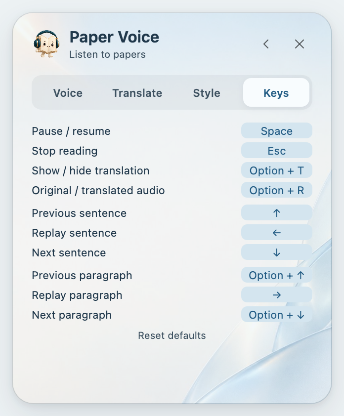

<h1 align="center">User guide</h1>

From your first selection to a complete paper.

<a href="GUIDE.md">简体中文</a> · <b>English</b>

<a href="../README.en.md">Product home</a> · <a href="INSTALL.en.md">Installation</a> · <a href="TRANSLATION.en.md">Translation</a>

## Contents

[Start listening](#your-first-reading) · [Modes](#choose-a-reading-mode) · [Continuous reading](#read-continuously-and-resume) · [Playback](#pause-navigate-and-replay) · [Voices](#choose-a-language-and-voice) · [Translation](#see-or-hear-a-translation) · [Appearance](#make-the-interface-yours) · [Shortcuts](#keyboard-shortcuts) · [Help](#updates-and-common-questions)

## Your first reading

Follow the [installation guide](INSTALL.en.md) to prepare voices and enable the plugin. Then open a PDF with selectable text.

1. Select a few words in the body text.
2. With automatic reading on, playback starts when you release the mouse. Otherwise, press Play in the selection menu.
3. Click the **book character** to open the panel and choose a mode. Press **Space** to pause or resume.

Choose a reading mode and starting point; the original text appears below.

The panel folds away when you click, select, annotate or manually scroll in the PDF; reading continues. Click the character to reopen it. Long original-text previews can be scrolled within their text area.

## Choose a reading mode

<table align="center">
<thead>
<tr>
  <th align="center">Mode</th>
  <th align="center">Reading scope</th>
  <th align="center">Useful for</th>
</tr>
</thead>
<tbody>
<tr>
  <td align="center"><strong>Sentence</strong></td>
  <td align="center">The full sentence containing your selection</td>
  <td align="center">Listening closely</td>
</tr>
<tr>
  <td align="center"><strong>Selection</strong></td>
  <td align="center">Exactly the selected text</td>
  <td align="center">A word, phrase or custom range</td>
</tr>
<tr>
  <td align="center"><strong>Paragraph</strong></td>
  <td align="center">The full paragraph containing your selection</td>
  <td align="center">Following an argument</td>
</tr>
<tr>
  <td align="center"><strong>Document</strong></td>
  <td align="center">From your chosen start toward the end</td>
  <td align="center">Continuous reading</td>
</tr>
</tbody>
</table>

Sentence, Selection and Paragraph support **1, 2, 3, 5 or continuous repeats**. Press Esc to stop.

You can switch modes while playing or paused. Switching to Sentence or Paragraph finishes the current unit; switching to Document continues onward. Changes made while paused take effect when you resume.

## Read continuously and resume

Under **Document → Start**, choose the first page, current page, last position or selected sentence.

**Start from a passage:** choose the selected-sentence option, select a word in the target sentence, then press **Read from here**. Once audio begins, the selection menu and mouse selection disappear, leaving the current sentence highlighted.

Highlighting and nearby captions keep your place visible. Sample text for demonstration.

**Return to your place:** Last position includes the latest progress from every reading mode. Reopen the same PDF after a restart or update to resume an unfinished session, or use this starting point.

The page follows playback across columns and pages. Clicking elsewhere does not stop continuous reading. Paper Voice filters recognizable citations, figure captions and publication details, and improves unit and script pronunciation. Complex layouts may still need manual selection; see [PDF support](COMPATIBILITY.en.md#pdf-and-positioning).

## Pause, navigate and replay

Hover over the **book character** to reveal the controls. They stay open while you use the buttons or submenus and close after you leave. Clicking the character still opens or closes the main panel. Keyboard users can focus the character, then press Tab to enter the controls.

On the bar, the **mode button** switches modes and **Pause/Resume** controls playback. Hover over Pause/Resume to reveal navigation:

- **Sentence:** previous, repeat current, next.
- **Paragraph:** previous, repeat current, next; available in Document and Paragraph modes.

Hover over Pause/Resume, then move into the navigation controls.

Replay a sentence without leaving Document mode. Press **Esc** to stop the session.

## Choose a language and voice

Open **Settings → Voice**. Choose the language, voice and speed, then select **Preview voice**.

Preview a voice before starting the paper.

- **Auto** detects the PDF language. For short or mixed-language text, choose English, Chinese, Japanese or French explicitly.
- English offers US and UK accents with male and female voices. Chinese defaults to **Yunxi**; Japanese defaults to **Tebukuro**.
- Voices are downloaded separately and run locally, independently of system voices.
- Use the folder icon to change the voice location. It is saved after a successful check; see [Voice folder](INSTALL.en.md#voice-folder).

## See or hear a translation

Open **Settings → Translate**, choose a service and target language, then select:

<table align="center">
<thead>
<tr>
  <th align="center">Option</th>
  <th align="center">Result</th>
</tr>
</thead>
<tbody>
<tr>
  <td align="center"><strong>Selection</strong></td>
  <td align="center">Translation beside a selection; on by default</td>
</tr>
<tr>
  <td align="center"><strong>Show translation</strong></td>
  <td align="center">Translation follows the current sentence during playback</td>
</tr>
<tr>
  <td align="center"><strong>Read translation</strong></td>
  <td align="center">Only the translation is spoken; the original stays highlighted</td>
</tr>
</tbody>
</table>

Selection scope completes partially selected English words; Sentence and Paragraph expand to the corresponding unit. The selection menu closes when playback begins.

While speech is being prepared, the button shows a loading animation. Click it again to cancel; your selection and translation stay in place so you can start again.

The first use of a voice may take a little longer. Opening the reading panel prepares the voice in advance. Long documents start with the selected sentence while later content is prepared in the background. Replaying recent content can reuse audio held in memory instead of generating it again.

Selection, Sentence and Paragraph change the translation scope.

On the floating bar, **click the caption button to cycle target languages; double-click to hide captions**. Hover over it and click the headset to switch original/translated audio: the theme accent means translated audio, gray means the original.

Caption fonts come from the fonts installed on your computer. Font size is adjustable, and overflowing text scrolls without a visible scrollbar. English, Chinese, Japanese and French support translated audio; other targets display text only.

Under **Settings → Translate → Caption position**, place captions above or below the original. Below is the default; width follows the current text region.

### LLM translation

See the [translation guide](TRANSLATION.en.md) for services, API keys and connection tests. Translation sends the required text to the selected service. Turn off all three translation options for offline original-text reading.

## Make the interface yours

Under **Settings → Style**, choose a theme, transparency and interface language, or import a background.

Use the ellipsis to reveal all themes; choosing one closes the expanded list.

The interface supports Chinese, English, Japanese, French and German, or follows the system. This does not change reading or translation languages. Character interactions can be disabled or given a different interval; system reduced-motion settings suppress them.

## Keyboard shortcuts

Use these in the PDF area **while playing or paused**. Search boxes, notes and settings keep their normal keyboard behavior.

<table align="center">
<thead>
<tr>
  <th align="center">Action</th>
  <th align="center">Mac</th>
  <th align="center">Windows</th>
</tr>
</thead>
<tbody>
<tr>
  <td align="center">Pause / resume</td>
  <td align="center">Space</td>
  <td align="center">Space</td>
</tr>
<tr>
  <td align="center">Stop</td>
  <td align="center">Esc</td>
  <td align="center">Esc</td>
</tr>
<tr>
  <td align="center">Previous / next sentence</td>
  <td align="center">↑ / ↓</td>
  <td align="center">↑ / ↓</td>
</tr>
<tr>
  <td align="center">Previous / next paragraph</td>
  <td align="center">Option + ↑ / ↓</td>
  <td align="center">Alt + ↑ / ↓</td>
</tr>
<tr>
  <td align="center">Repeat sentence</td>
  <td align="center">←</td>
  <td align="center">←</td>
</tr>
<tr>
  <td align="center">Repeat paragraph</td>
  <td align="center">→</td>
  <td align="center">→</td>
</tr>
<tr>
  <td align="center">Show / hide captions</td>
  <td align="center">Option + T</td>
  <td align="center">Alt + T</td>
</tr>
<tr>
  <td align="center">Switch original / translated audio</td>
  <td align="center">Option + R</td>
  <td align="center">Alt + R</td>
</tr>
</tbody>
</table>

Change keys under **Settings → Keys**. Your new assignment takes priority: the displaced action receives the released key if possible, or becomes Unassigned. The result appears below. Use × to clear one binding or Reset defaults to restore all. Common system conflicts are flagged, but not every third-party shortcut can be detected.

Click a shortcut, then press your preferred combination.

## Updates and common questions

### How do I update?

Check from **Settings → Voice**, or enable daily, weekly or monthly checks. The character shows an update badge when a version is available; install it or skip that version. Zotero's plugin manager also checks for updates; its automatic installation setting is independent of the reminder interval. [Upgrades and migration](INSTALL.en.md#updating-an-existing-installation)

### Selecting text produces no sound

Check that the PDF has a text layer, preview the voice, and check system volume and output. With automatic reading off, press Play after selecting. Run the installer if voices are missing.

### No translation appears

Selection translation controls the selection menu; Captions controls the translation during playback. Check the relevant option, network and target language, then retry or switch services. Tencent currently does not support Traditional Chinese; use Microsoft instead.

### The reading language is wrong

Choose a language manually in Voice settings, especially for short or mixed-language text.

### Text is skipped, read in the wrong order or not filtered

Try Selection mode for a smaller range. If it persists, report the page, original sentence, reading mode and version in [Issues](https://github.com/JunyanKang/paper-voice/issues). Do not post unpublished papers or a private library.

---

[Contents](#contents) · [Installation](INSTALL.en.md) · [Translation](TRANSLATION.en.md) · [Compatibility](COMPATIBILITY.en.md) · [Privacy](../PRIVACY.en.md)
