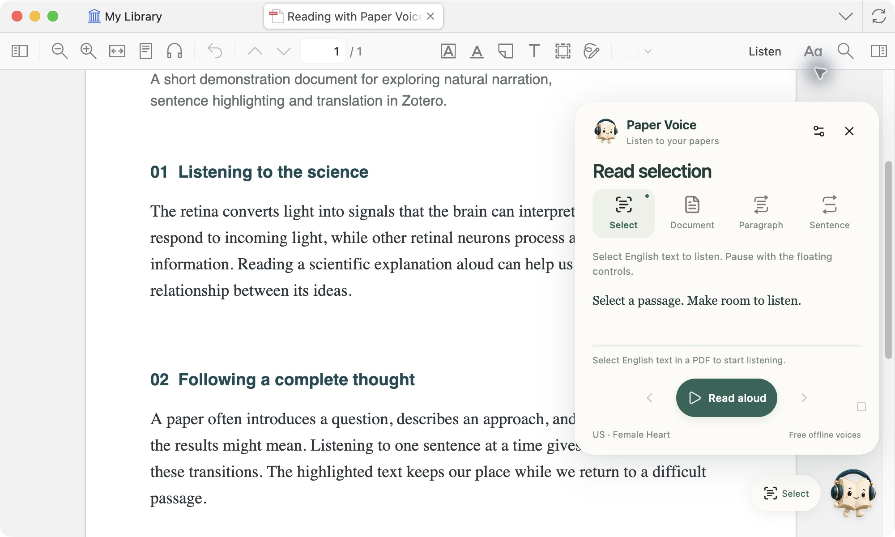
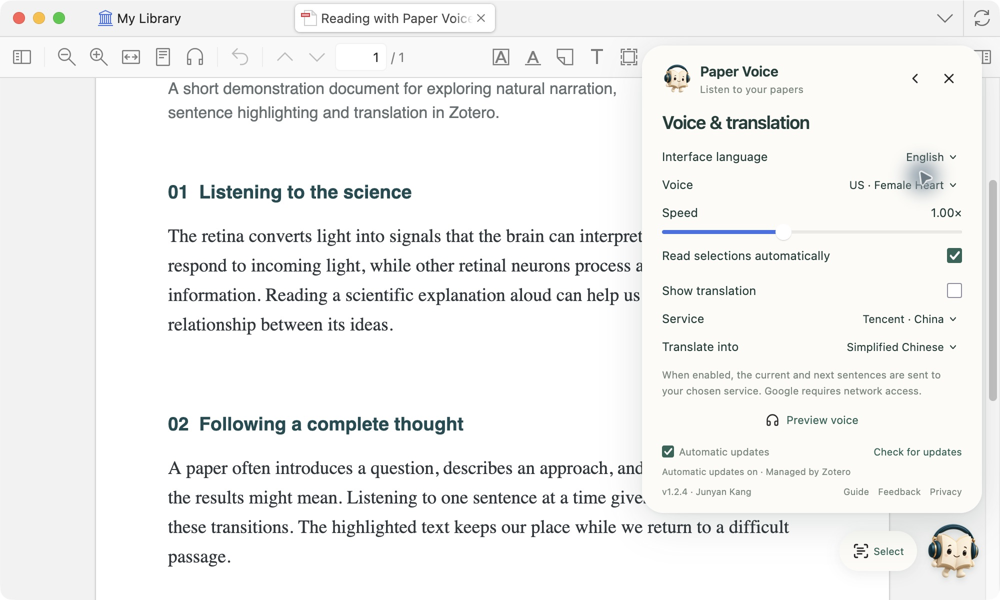
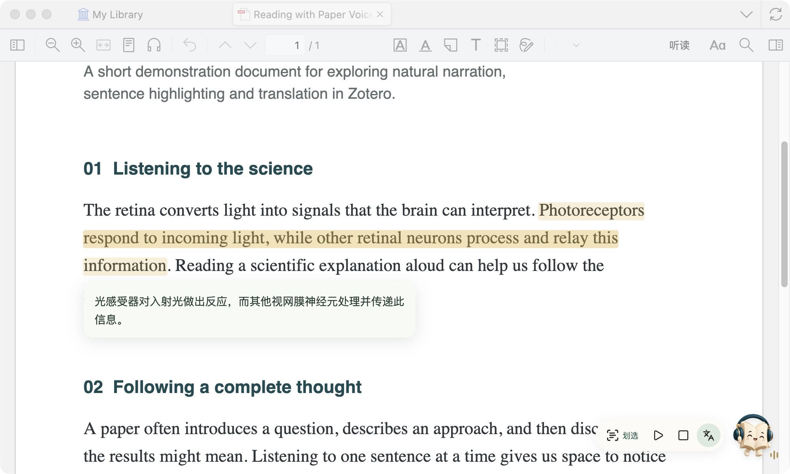

<a href="GUIDE.md">简体中文</a> · <b>English</b>

# From the first sentence to a deeper reading

**Paper Voice user guide** · [Product home](../README.en.md) · [Installation](INSTALL.en.md)

Select a passage to start listening. Explore the real interface below to find your voice and reading rhythm.

## 01 · Meet your reading controls

Click the floating book mascot in the PDF reader. Four icons represent the reading modes; the highlighted icon is active.

| What you want to do | Mode | Next step |
|---|---|---|
| Listen to a passage | **Select** | Select English text and release the mouse. |
| Read continuously | **Document** | Choose a starting point and start reading. |
| Revisit an argument | **Paragraph** | Select a paragraph; repeat it 2, 3, 5 times or continuously. |
| Focus on one sentence | **Sentence** | Select a passage and use the arrows to move between sentences. |

Close the panel to keep only the compact controls. During playback, pause, stop and translation buttons appear beside the mascot. Drag the mascot to move it.

## 02 · Start where you want

Continuous reading offers **First page**, **Current page**, **Last position** and **Selected sentence**.

Choose **Selected sentence**, then select a letter, word or sentence in the PDF. Click **Read from this sentence**. If the sentence starts in a previous column or on the previous page, reading returns to that complete sentence's beginning.

**Last position** uses the most recent actual playback in that PDF, across all modes. Ordinary clicks, scrolling and selections do not interrupt continuous reading.

## 03 · Make the interface yours

Open settings with the icon at the top right. Choose **English**, **简体中文**, or **System / 跟随系统** for the interface. This choice is separate from the translation target language.

Preview the six US and UK voices to find the one you prefer. Adjust speed from **0.60–1.60×**. Voice and speed changes apply when you start reading again; switching the interface language leaves active playback running.

## 04 · Keep translation close

Enable **Show translation**, then choose a service and target language. This displays a translation; it does not read the translation aloud.

The translation follows the current reading segment across columns and pages. Pausing retains the highlight and translation; stopping clears them. Toggle translation anytime from the compact controls.

Tencent is the default. Microsoft and Google are alternatives; use Microsoft or Google for Traditional Chinese. Translations do not rewrite your PDF or create permanent annotations.

## Useful shortcuts

| Shortcut | Action |
|---|---|
| `Option/Alt + P` | Pause / resume |
| `Option/Alt + T` | Show / hide translation |
| `Esc` | Stop |

Common citation markers and numbered figure references are skipped during narration. Expressions such as `and/or`, `i.e.` and `e.g.` are expanded for natural listening.

---

[Compatibility & usage notes](COMPATIBILITY.en.md) · [Privacy](../PRIVACY.md) · [Feedback](https://github.com/JunyanKang/paper-voice/issues)

Screenshots show the actual macOS interface with a purpose-written demonstration PDF. The Windows plugin provides the same features.
