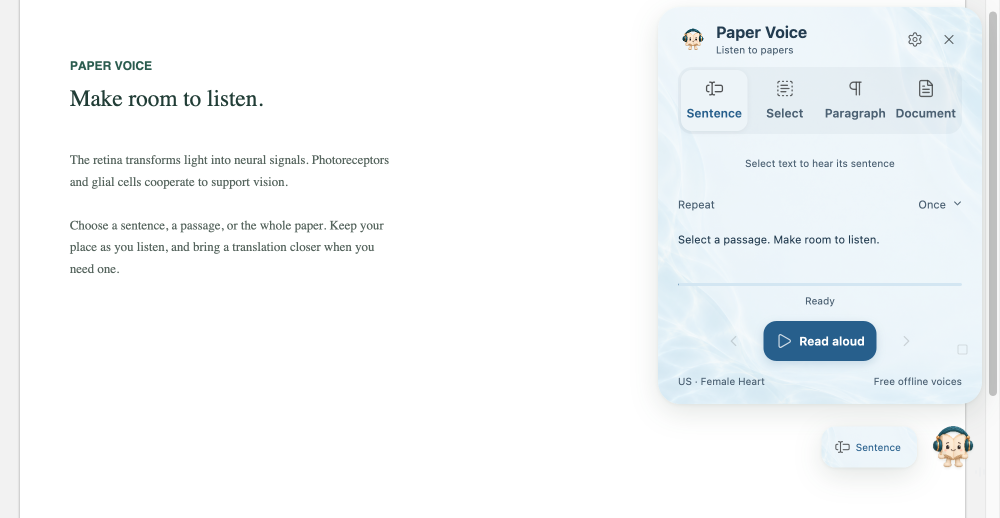
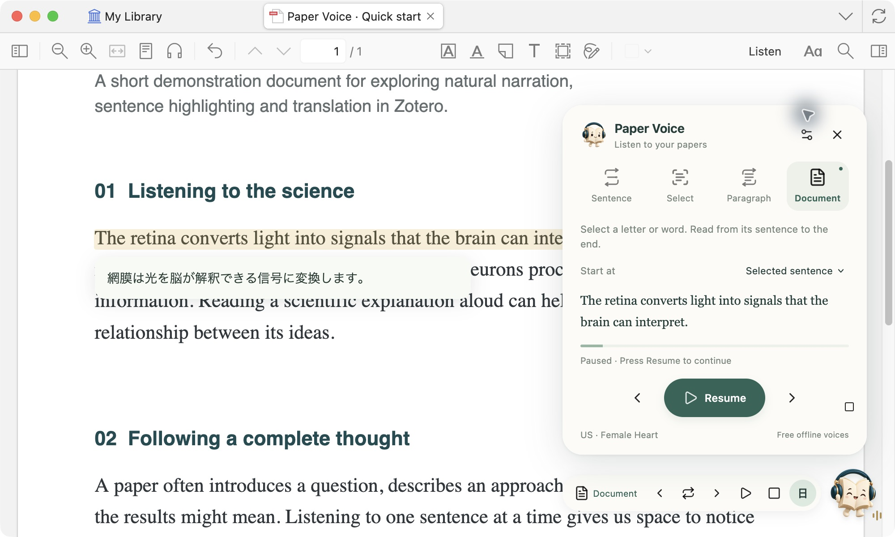
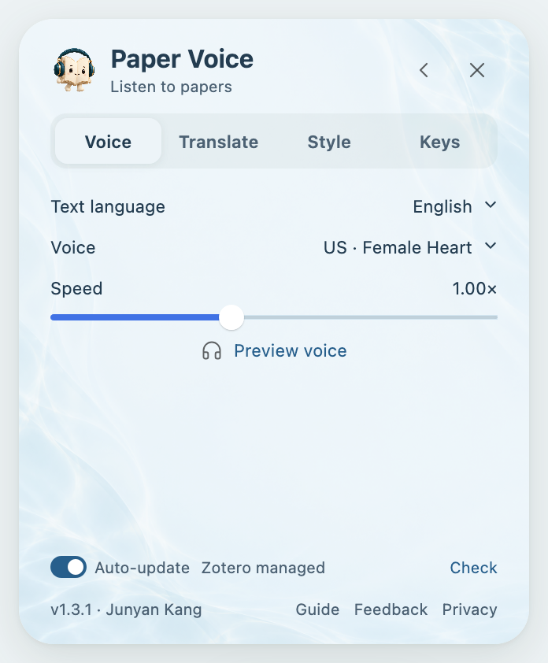
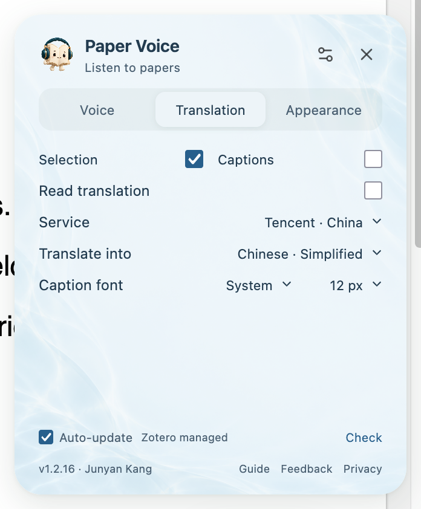

# Paper Voice user guide

[Product home](../README.en.md) · [简体中文](GUIDE.md) / **English** · [Installation help](INSTALL.en.md)

Start with a selected passage, then find your own pace for a whole paper. This guide covers reading, translation and settings in the order you will use them.

## Contents

1. [Your first reading](#your-first-reading)
2. [Choose a reading mode](#choose-a-reading-mode)
3. [Read continuously and resume](#read-continuously-and-resume)
4. [Pause, navigate and replay](#pause-navigate-and-replay)
5. [Choose a language and voice](#choose-a-language-and-voice)
6. [See or hear a translation](#see-or-hear-a-translation)
7. [Make the interface yours](#make-the-interface-yours)
8. [Keyboard shortcuts](#keyboard-shortcuts)
9. [Updates and common questions](#updates-and-common-questions)

## Your first reading

### Install the voices and plugin

Choose a complete package for your computer on the [download page](../README.en.md#download), extract it, and open the installer. Select **Install voices**. Once **Voices ready** appears, open **Tools → Plugins → gear → Install Plugin From File** in Zotero and select the included `.xpi`.

Figure 1 · Choose English or Chinese in the installer. The completion status appears beside the first step.

On Windows, keep the `Resources` folder beside the installer. See [Installation help](INSTALL.en.md) for detailed steps, system prompts and uninstall instructions.

### Select a passage

1. Open a PDF with **selectable text** in Zotero.
2. Select some body text and release the mouse to start listening.
3. Click the **book mascot** in the lower-right corner to open the panel, choose a reading mode or enter Settings.

Figure 2 · Choose what to read in the main panel. Floating controls remain available when you close the panel.

To select text before starting playback, turn off **Auto-read selection** under **Settings → Voice**, then use **Read aloud** when ready.

## Choose a reading mode

The four modes appear at the top of the main panel. The active mode is highlighted.

| Mode | What it reads | Useful for |
|---|---|---|
| **Sentence** | Select a letter or word to hear its whole sentence | Studying a long sentence or practicing pronunciation |
| **Select** | Only the text you selected | A word, phrase or custom passage |
| **Paragraph** | Select any text in a paragraph to hear the whole paragraph | Following an argument or reviewing a key passage |
| **Document** | From your chosen starting point to the end | Listening continuously or returning to a paper |

**To repeat a passage:** In Sentence, Select or Paragraph mode, set Repeat to once, 2, 3, 5 times, or Loop. Select Stop or press Esc to end playback.

**To change modes while listening:** Choose a mode in the panel, or click the floating mode button to cycle through them. The current audio is not cut off: switching from Document to Sentence or Paragraph finishes the current sentence or paragraph, then ends. Switching to Document continues onward from the current passage.

## Read continuously and resume

### Choose where to begin

In **Document** mode, use **Start at**:

| Starting point | What happens |
|---|---|
| **First page** | Starts at the beginning of the document |
| **Current page** | Starts with the body text on the current page |
| **Last position** | Returns to the most recent position in this PDF, including reading in Sentence, Select or Paragraph mode |
| **Selected sentence** | Starts at the beginning of the sentence containing your selection |

To listen from a specific sentence onward: choose **Selected sentence** → select a word in that sentence → click **Read from this sentence**.

Figure 3 · Source highlighting and nearby translation help you keep your place during continuous reading.

### Follow the text and keep your place

The current passage is highlighted as the view scrolls, moves between columns and turns pages. An ordinary click elsewhere in the PDF does not end continuous reading; use Pause when you want a break.

After restarting Zotero or updating the plugin, reopen the same PDF and select **Resume** to continue an unfinished session. You can also choose **Last position** in Document mode.

Paper Voice skips recognizable citations, figure captions, headers, footers and publication details while retaining meaningful explanatory figure references. These changes apply only to listening; your PDF and annotations stay unchanged.

## Pause, navigate and replay

Once reading starts, use the floating controls in the lower-right corner without keeping the main panel open.

| Control | How to use it |
|---|---|
| **Mode button** | Click to cycle modes; hover to reveal sentence and paragraph navigation |
| **Pause / resume** | Pause at your current position; click again to continue |
| **Stop** | End the current playback |
| **Translation button** | Click to change language; double-click to hide translations; hover to switch original or translated audio |
| **Book mascot** | Open or close the main panel |

Hover over the **mode button**, then move into the expanded navigation area:

- **Sentence row:** previous sentence, replay sentence, next sentence.
- **Paragraph row:** previous paragraph, replay paragraph, next paragraph; available in Document and Paragraph modes.

For example, if you miss a sentence during continuous reading, choose Replay sentence to hear it again without switching to Sentence mode. You can also use the [keyboard shortcuts](#keyboard-shortcuts).

## Choose a language and voice

Open **Settings → Voice**.

Figure 4 · Preview a voice, then adjust the pace to suit your listening.

1. **Text language:** Auto-detect is the default. You can also choose English, Mandarin Chinese, Japanese or French. Manual selection helps with short passages or mixed-language text.
2. **Voice:** Choose from the voices for that language. English offers US and UK accents, with male and female voices. Mandarin defaults to Yunxi; Japanese defaults to Tebukuro.
3. **Speed:** Adjust the slider. Start reading again to use a newly selected voice or speed.
4. **Preview voice:** Hear a short sample before making your choice.

The complete package includes offline voices that generate speech on your computer. They do not depend on your system's built-in voices, and require no subscription or API key.

## See or hear a translation

Open **Settings → Translation** to choose a service and target language.

Figure 5 · Showing a translation and reading it aloud are separate choices.

### Listen to the original and read the translation

Turn on **Show translation**. Translated text appears near the current source passage and follows the reading position. This setting alone does not play translated audio.

Text translation targets include Simplified Chinese, Traditional Chinese, Japanese, Korean, French, English, German, Spanish and Russian. Adjust **Caption font** and **Caption size** on the same page.

### Listen only to the translation

Turn on **Read translation** to hear translated sentences while the PDF's original text remains highlighted and in view. Turn it off to return to the original audio. Changes during playback apply from the next sentence.

Translated audio supports Chinese, Japanese, French and English. Other target languages are available as text but do not have an offline voice.

### Switch from the floating controls

- **Click the translation button:** cycle through target languages; its language label changes to match.
- **Double-click:** hide translations.
- **Hover:** reveal the Read translation switch above the button, then click to choose translated or original audio.
- **Option + T on Mac / Alt + T on Windows:** show or hide translations without changing the target language.

### Choose a translation service

| Service | When to choose it |
|---|---|
| **Tencent** | The default, intended for mainland China |
| **Microsoft** | For Traditional Chinese, or as an alternative when another service cannot connect |
| **Google** | When your network can access Google Translate |

Use Microsoft or Google for Traditional Chinese. Translation needs internet access and sends the current sentence and prefetched next sentence to your selected service. Original-text reading works offline when translation is off. If a free service is unavailable, switch services or try again later. [Privacy details](../PRIVACY.md)

## Make the interface yours

Open **Settings → Appearance**.

Figure 6 · Themes and interface preferences are together on one page, with changes visible immediately.

| To change… | Use… |
|---|---|
| **Colors** | Porcelain, Botanical, Tidal, Amber or Midnight; Tidal is the default |
| **Your background** | Import image accepts PNG, JPG and WebP files stored only on your computer. Use My image to return to it, or Remove to delete it |
| **Transparency** | Move the slider; higher values make the background more transparent while text and controls remain clear |
| **Interface language** | Choose Chinese, English or System; this does not change the reading or translation language |
| **Companion gestures** | Turn gestures on or off, choose an interval, or select Preview. Hovering over the mascot also triggers a gesture |

Translation font and size are under **Settings → Translation**.

## Keyboard shortcuts

Use these in the **PDF reading area while playing or paused**. Keys keep their normal behavior in search fields, notes and settings.

| Action | Mac | Windows |
|---|---|---|
| Pause / resume | Space | Space |
| Stop reading | Esc | Esc |
| Previous / next sentence | ↑ / ↓ | ↑ / ↓ |
| Previous / next paragraph | Option + ↑ / ↓ | Alt + ↑ / ↓ |
| Replay current sentence | ← | ← |
| Replay current paragraph | → | → |
| Show / hide translation | Option + T | Alt + T |

Start with three: **Space to pause, ↓ for the next sentence, ← to hear this sentence again**.

## Updates and common questions

### How do I update?

Enable **Auto-update** at the bottom of Settings for Zotero to check periodically, or select **Check → Install update**. Downloads and updates require access to GitHub.

- **Upgrading from 1.2.5 or earlier:** download the latest complete package and run the installer to reinstall offline voices once.
- **Already installed a complete package from 1.2.6 or later:** update only the `.xpi` plugin. No voice download is needed.

You can also download the `.xpi` from [Releases](https://github.com/JunyanKang/paper-voice/releases/latest) and install it through Zotero's plugin manager. The `updates.json` file is for automatic updates; you do not need to download it.

### Selecting text produces no sound

Check that the PDF has selectable text; scanned pages need OCR first. Preview a voice in Settings, then check your computer's volume and output device. If automatic reading is off, select text and press Play. If voices are missing, run the installer again.

### No translation appears

Check that Show translation is on, then check your network and target language. Google needs network access, and Tencent does not currently provide Traditional Chinese. Try Microsoft or another supported combination.

### The reading language is wrong

Choose the language manually under **Settings → Voice → Text language**. The interface language, source reading language and translation target are independent settings.

### Text is skipped, read in the wrong order or not filtered

Columns, text encoding and unusual PDF layouts can affect recognition. Try a smaller passage in Select mode. If the problem remains, open an [issue](https://github.com/JunyanKang/paper-voice/issues) with the page number, original sentence, reading mode and version information. Do not share unpublished papers or your personal library publicly.

---

[Back to contents](#contents) · [Product home](../README.en.md) · [Install or uninstall](INSTALL.en.md) · [Compatibility](COMPATIBILITY.en.md) · [Privacy](../PRIVACY.md)
