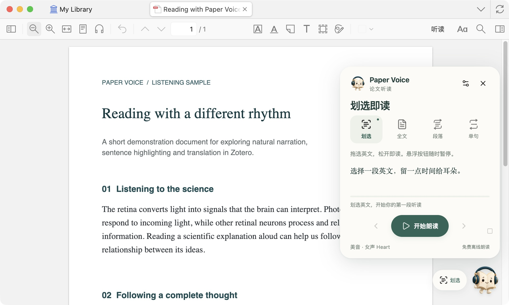
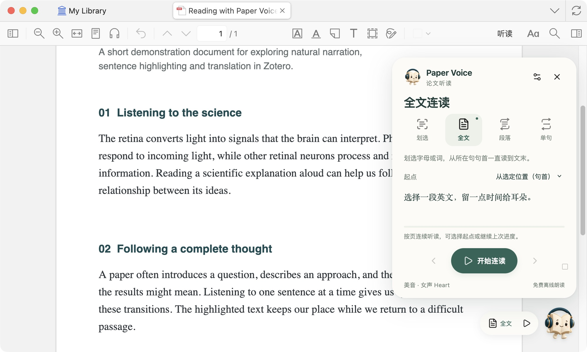
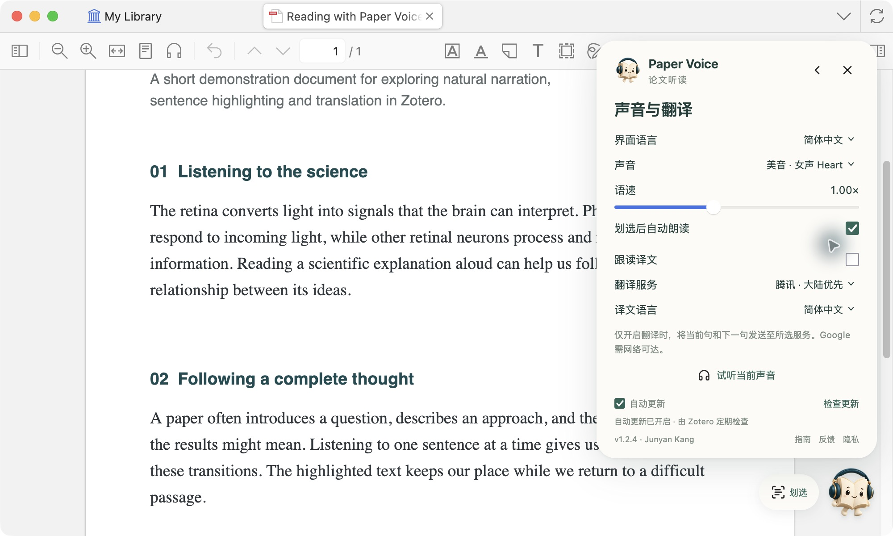

<b>简体中文</b> · <a href="GUIDE.en.md">English</a>

# 从第一句，读到更深处

**Paper Voice 使用指南** · [返回产品首页](../README.md) · [安装指南](INSTALL.md)

开始听读，只需划选一段英文。下面用实际界面，带你找到适合自己的声音和节奏。

[认识面板](#01--认识你的听读面板) · [连续阅读](#02--从你想听的地方开始) · [声音与语言](#03--选择声音与界面语言) · [随行译文](#04--让译文紧随原文)

## 01 · 认识你的听读面板

点击 PDF 右下角的书页精灵，展开面板。四个图标从左到右，对应四种阅读方式；有底色的图标是当前模式。

| 想做什么 | 选择这个模式 | 然后这样做 |
|---|---|---|
| 快速听一段 | **划选** | 拖选英文，松开后开始。 |
| 连续听整篇 | **全文** | 选择起点，点击开始连读。 |
| 反复理解一段 | **段落** | 划选段落，选择 2、3、5 次或持续循环。 |
| 逐句精听 | **单句** | 划选一段，用左右箭头切换句子。 |

点击 × 收起面板后，精灵仍留在原位；朗读时旁边会出现暂停、停止和译文快捷按钮。精灵可以拖动。

## 02 · 从你想听的地方开始

全文连读提供四种起点：**第 1 页、当前页、上次进度、选定位置（句首）**。

想从文中某句话开始：先选择「从选定位置（句首）」，再划选该句中的一个字母、单词或整句，点击「从此句开始连读」。即使选中的是跨栏或跨页的后半句，也会回到完整句的开头。

「从上次进度」使用这篇 PDF 最近一次实际播放的位置，包括划选、段落和单句模式。连续阅读中，普通点击和滚动不会打断播放。

## 03 · 选择声音与界面语言

点击面板右上角的设置图标。**界面语言**可以选择简体中文、English，或跟随 Zotero；它与**译文语言**分别设置。

选择一种声音，点击「试听当前声音」比较音色。语速可在 **0.60–1.60×** 之间调整；声音与速度的修改会在下一次开始朗读时生效。

| | 美式英语 | 英式英语 |
|---|---|---|
| 女声 | Heart、Bella | Emma |
| 男声 | Michael、Fenrir | George |

## 04 · 让译文紧随原文

开启「跟读译文」，选择翻译服务与目标语言。它会**显示译文**，不会额外朗读译文。

译文跟随当前朗读片段，跨栏、跨页时一起移动。暂停时保留高亮与译文；停止后清除。悬浮控制旁的译文按钮，可随时开关显示。

默认使用腾讯；也可选择微软或 Google。繁体中文请使用微软或 Google。译文只用于当前阅读，不会改写 PDF 或生成永久批注。

## 把常用操作留在手边

| 快捷键 | 动作 |
|---|---|
| `Option/Alt + P` | 暂停 / 继续 |
| `Option/Alt + T` | 显示 / 隐藏译文 |
| `Esc` | 停止 |

常见数字引文、作者年份、可识别的上标，以及带编号的图表引用（如 `Fig. 1Ba`）会在朗读时略过。混合括号中的引用会被略过，科学说明仍保留；全文连读也会跳过页面底部可识别的小字出版信息。`and/or`、`i.e.`、`e.g.` 会转换为适合听读的英文表达。

---

[兼容性与使用说明](COMPATIBILITY.md) · [隐私说明](../PRIVACY.md) · [反馈与建议](https://github.com/JunyanKang/paper-voice/issues)

截图来自实际 macOS 界面，文档内容为专门制作的阅读示例；Windows 提供相同的插件功能。
