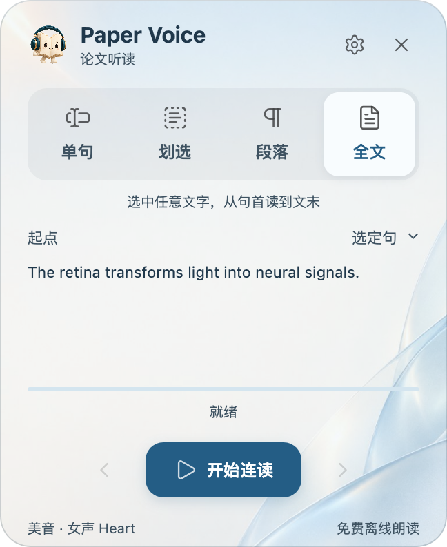

<h1 align="center">使用指南</h1>

从第一次划选，到连续听完整篇论文。

<b>简体中文</b> · <a href="GUIDE.en.md">English</a>

<a href="../README.md">产品首页</a> · <a href="INSTALL.md">安装指南</a> · <a href="TRANSLATION.md">翻译指南</a>

## 目录

[开始听读](#开始第一次听读) · [阅读模式](#选择阅读模式) · [连续阅读](#连续阅读与恢复进度) · [播放控制](#暂停跳转与重读) · [声音](#选择语言与声音) · [翻译](#看译文与听译文) · [外观](#调整阅读界面) · [快捷键](#键盘快捷键) · [常见问题](#更新与常见问题)

## 开始第一次听读

先按 [安装指南](INSTALL.md) 安装声音与插件，再打开一篇可以选中文字的 PDF。

1. 在正文中划选几个词。
2. 自动朗读开启时，松开鼠标即可播放；关闭时，点击划词菜单里的播放按钮。
3. 点击 **书页精灵** 展开主面板，选择阅读模式。按 **空格** 暂停或继续。

主面板选择阅读模式与起点，下方查看正在听的原文。

点击正文、划选、批注或手动滚动时，面板会自动收起，朗读保持进行；点击精灵即可再次展开。原文预览较长时，可在文字区域滚动查看。

## 选择阅读模式

<table align="center">
<thead>
<tr>
  <th align="center">模式</th>
  <th align="center">朗读范围</th>
  <th align="center">常见用途</th>
</tr>
</thead>
<tbody>
<tr>
  <td align="center"><strong>单句</strong></td>
  <td align="center">选中文字所在的完整句子</td>
  <td align="center">精听长句</td>
</tr>
<tr>
  <td align="center"><strong>划选</strong></td>
  <td align="center">实际选中的文字</td>
  <td align="center">听词语或自选范围</td>
</tr>
<tr>
  <td align="center"><strong>段落</strong></td>
  <td align="center">选中文字所在的完整段落</td>
  <td align="center">理解一段论述</td>
</tr>
<tr>
  <td align="center"><strong>全文</strong></td>
  <td align="center">从指定起点连续向后</td>
  <td align="center">连读与续读</td>
</tr>
</tbody>
</table>

单句、划选和段落可设置 **1、2、3、5 次或持续循环**。按 Esc 结束播放。

朗读或暂停时都可以切换模式。切到单句／段落，会完成当前句／段后结束；切到全文，则继续向后读。暂停时修改，会在继续后按新模式执行。

## 连续阅读与恢复进度

在 **全文 → 起点** 选择：首页、当前页、上次位置或选定句。

**从文中某处开始：** 选择「选定句」，在目标句中划选一个词，再点「从此句开始连读」。声音开始后，划词菜单与鼠标选区自动收起，保留正在朗读句子的高亮。

高亮与译文帮助你保持阅读位置。示例文字用于演示。

**接着上次听：**「上次位置」包含所有阅读模式的最近进度。重启或更新后，重新打开同一篇 PDF 可恢复未结束的听读，也可通过这个起点继续。

页面跟随朗读滚动、换栏和翻页。普通点击其他位置不会停止全文连读。插件会过滤可识别的引文、图注和出版信息，优化单位与上下标读法；复杂排版仍可能需要手动划选，详见 [兼容性](COMPATIBILITY.md#pdf-与定位)。

## 暂停、跳转与重读

悬浮控制条中，**模式按钮**切换模式，**暂停／继续**控制播放，**书页精灵**开关面板。悬停暂停按钮即可展开导航：

- **句子：** 上一句、重读当前句、下一句。
- **段落：** 上一段、重读当前段、下一段；全文和段落模式提供这组操作。

悬停暂停按钮展开导航，移入后即可点击。

全文模式也能重听一句，不必先切换到单句模式。停止本次朗读可按 **Esc**。

## 选择语言与声音

打开 **设置 → 声音**，按顺序选择语言、声音和语速，再点击 **试听当前声音**。

先试听，再开始正文听读。

- **自动**根据 PDF 内容识别语言；短文本或混合语言判断不准时，手动选英语、中文、日语或法语。
- 英语提供美音、英音及男女声；中文默认 **Yunxi**，日语默认 **Tebukuro**。
- 声音由安装器单独下载，在本机合成，不依赖系统自带音色。
- 点击文件夹图标可修改声音位置，测试通过后保存；具体步骤见 [声音位置](INSTALL.md#声音位置)。

## 看译文与听译文

打开 **设置 → 译文**，先选服务和目标语言，再选择：

<table align="center">
<thead>
<tr>
  <th align="center">选项</th>
  <th align="center">结果</th>
</tr>
</thead>
<tbody>
<tr>
  <td align="center"><strong>划词翻译</strong></td>
  <td align="center">划选后，就近显示译文；默认开启</td>
</tr>
<tr>
  <td align="center"><strong>显示译文</strong></td>
  <td align="center">朗读时，译文跟随当前原句</td>
</tr>
<tr>
  <td align="center"><strong>朗读译文</strong></td>
  <td align="center">只听译文，原文仍高亮定位</td>
</tr>
</tbody>
</table>

划选范围会补全没有选完整的英文单词；单句和段落会扩展到对应范围。开始播放后，划词菜单自动消失。

划选、单句、段落三个按钮控制翻译范围。

悬浮栏中的译文按钮 **单击切换目标语种，双击关闭显示**。悬停后点击耳麦可切换原文／译文朗读：主题亮色表示听译文，灰色表示听原文。

译文字体来自本机实际安装的字体，可调整字号；窗口内容超出时可滚动，不显示滚动条。中、英、日、法可朗读译文，其他目标语种提供文字显示。

在 **设置 → 译文 → 译文位置** 选择原文上方或下方，默认下方；译文窗口宽度随正文所在区域调整。

### 大模型翻译

免费翻译服务、大模型设置及连接方法见 [翻译指南](TRANSLATION.md)。翻译会发送所需文字至所选服务；关闭三项翻译开关后可离线听原文。

## 调整阅读界面

打开 **设置 → 外观**，选择主题、透明度与界面语言，也可导入自己的背景。

点击省略号展开全部主题；选中后自动收起。

界面支持中文、英文、日文、法文和德文，或跟随系统，与朗读及翻译语言互不影响。角色互动可关闭或调整间隔；系统开启减少动态效果时不播放互动。

## 键盘快捷键

在 PDF 区域 **朗读或暂停时** 使用。搜索框、笔记和设置中的按键保留原用途。

<table align="center">
<thead>
<tr>
  <th align="center">操作</th>
  <th align="center">Mac</th>
  <th align="center">Windows</th>
</tr>
</thead>
<tbody>
<tr>
  <td align="center">暂停／继续</td>
  <td align="center">空格</td>
  <td align="center">空格</td>
</tr>
<tr>
  <td align="center">停止</td>
  <td align="center">Esc</td>
  <td align="center">Esc</td>
</tr>
<tr>
  <td align="center">上一句／下一句</td>
  <td align="center">↑ / ↓</td>
  <td align="center">↑ / ↓</td>
</tr>
<tr>
  <td align="center">上一段／下一段</td>
  <td align="center">Option + ↑ / ↓</td>
  <td align="center">Alt + ↑ / ↓</td>
</tr>
<tr>
  <td align="center">重读当前句</td>
  <td align="center">←</td>
  <td align="center">←</td>
</tr>
<tr>
  <td align="center">重读当前段</td>
  <td align="center">→</td>
  <td align="center">→</td>
</tr>
<tr>
  <td align="center">显示／隐藏译文</td>
  <td align="center">Option + T</td>
  <td align="center">Alt + T</td>
</tr>
<tr>
  <td align="center">切换原文／译文朗读</td>
  <td align="center">Option + R</td>
  <td align="center">Alt + R</td>
</tr>
</tbody>
</table>

在 **设置 → 快捷键** 中修改。新设置优先：已占用的操作会交换到释放的按键，无法交换时变为「未设置」，结果显示在下方。× 清除一项，「恢复默认」还原全部。常见系统组合会提示可能被占用，但无法预知所有第三方快捷键。

点击按键，再输入新的组合。

## 更新与常见问题

### 怎样更新？

在 **设置 → 声音** 点击检查更新，也可启用按天、周或月检查。发现更新时精灵显示徽标，可安装或忽略该版本。Zotero 插件管理器也可检查更新；其自动安装设置独立于插件的提醒周期。[升级与旧版迁移](INSTALL.md#更新已有插件)

### 划选后没有声音

确认 PDF 有文本层，再试听声音并检查音量、输出设备。关闭自动朗读时需要点击播放；声音未安装时重新运行安装器。

### 译文没有出现

选区菜单由「划词翻译」控制，随读译文由「显示译文」控制。确认相应开关、网络和目标语种，必要时换服务或重试。腾讯目前不支持繁体中文，可选微软。

### 朗读语言判断不对

在声音设置中手动指定语言，尤其是短句或多语混排内容。

### 个别内容被漏读、顺序不对或没有过滤

先用划选模式缩小范围；仍有问题时，在 [Issues](https://github.com/JunyanKang/paper-voice/issues) 提供页码、原句、阅读模式和版本。请勿公开未发表论文或私人文献库。

---

[返回目录](#目录) · [安装指南](INSTALL.md) · [翻译指南](TRANSLATION.md) · [兼容性](COMPATIBILITY.md) · [隐私](../PRIVACY.md)
