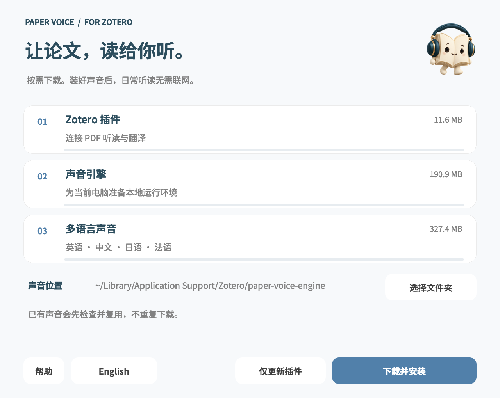
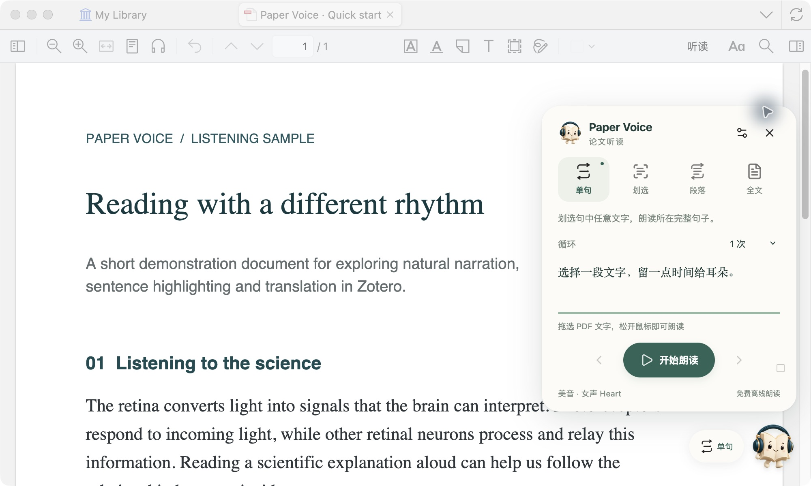
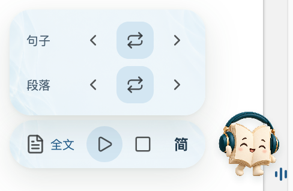
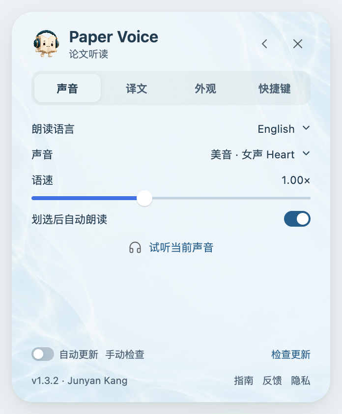
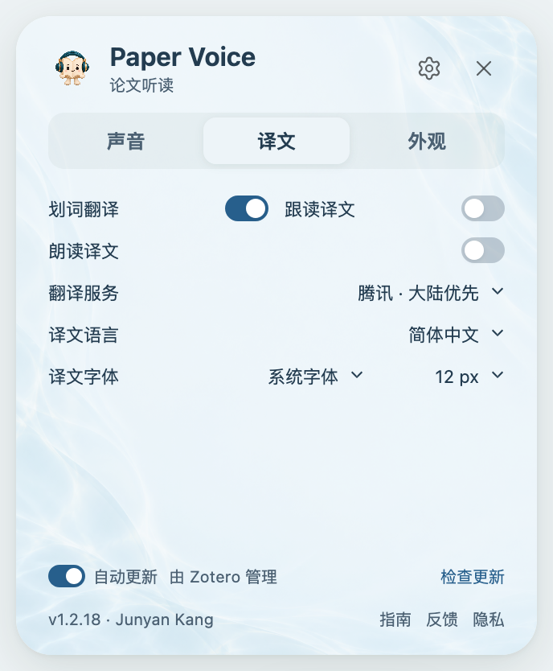
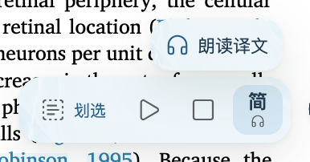
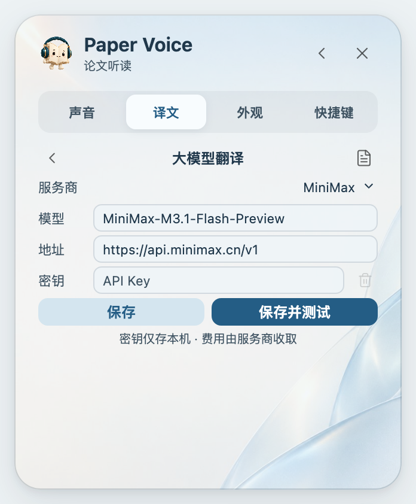
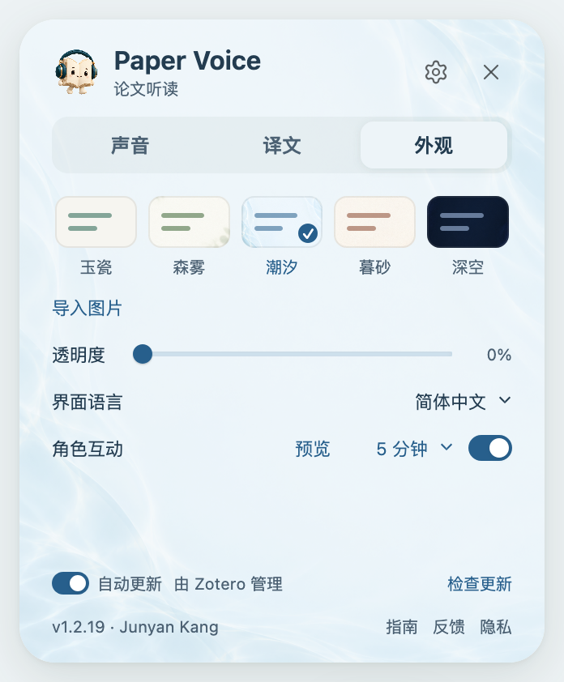
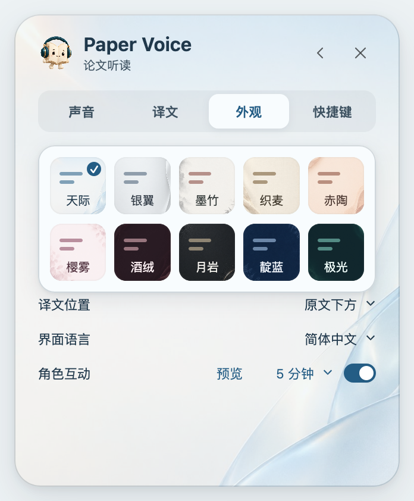
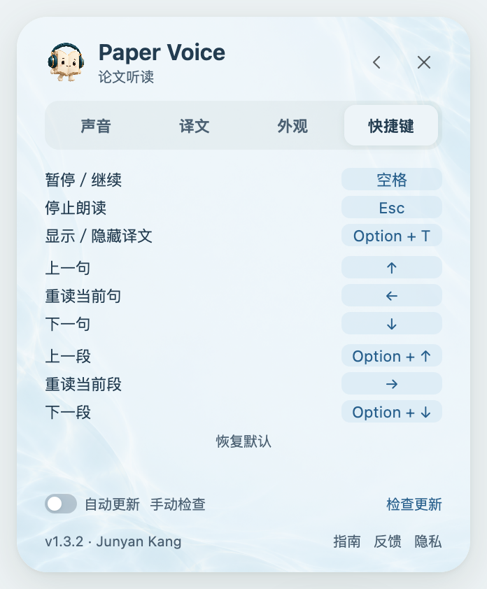

# Paper Voice 使用指南

[产品首页](../README.md) · **简体中文** / [English](GUIDE.en.md) · [安装帮助](INSTALL.md)

从第一次划选，到按自己的节奏听完整篇论文。本指南按操作顺序介绍听读、翻译和设置。

## 目录

1. [开始第一次听读](#开始第一次听读)
2. [选择阅读模式](#选择阅读模式)
3. [连续阅读与恢复进度](#连续阅读与恢复进度)
4. [暂停、跳转与重读](#暂停跳转与重读)
5. [选择语言与声音](#选择语言与声音)
6. [看译文与听译文](#看译文与听译文)
7. [大模型翻译](#大模型翻译)
8. [调整阅读界面](#调整阅读界面)
9. [键盘快捷键](#键盘快捷键)
10. [更新与常见问题](#更新与常见问题)

## 开始第一次听读

### 先安装声音与插件

从 [下载页](../README.md#下载与安装) 选择适合电脑的完整包，解压后打开安装助手。点击 **安装声音**，看到 **声音已就绪** 后，在 Zotero 的 **工具 → 插件 → 齿轮 → 从文件安装插件** 中选择包内的 `.xpi`。

图 1 · 安装助手支持中英文切换；声音安装完成后，状态显示在第一步右侧。

Windows 用户请保留安装助手旁的 `Resources` 文件夹。具体安装步骤、系统提示和卸载方法见 [安装帮助](INSTALL.md)。

### 再选一段文字

1. 在 Zotero 中打开一篇 **可以选中文字** 的 PDF。
2. 拖选正文，松开鼠标，即可开始朗读。
3. 点击右下角的 **书页精灵**，展开面板，选择阅读模式或打开设置。

图 2 · 在主面板选择听读范围；收起面板后，仍可通过悬浮控制条操作。

如果希望先看译文再播放，在 **设置 → 声音** 中关闭「划选后自动朗读」。划选后，点击选区菜单里的 **自然朗读**；全文模式选择「选定句」时，按钮显示为 **从此句开始连读**。

## 选择阅读模式

四种模式位于主面板顶部，选中的模式会突出显示。

| 模式 | 怎样选择内容 | 适合什么场景 |
|---|---|---|
| **单句** | 选中句中的一个字母或单词，朗读所在完整句子 | 精听长句、练习发音 |
| **划选** | 只朗读实际选中的文字 | 听一个词、短语或自选范围 |
| **段落** | 选中段中的任意文字，朗读所在完整段落 | 理解一段论述、反复听重点 |
| **全文** | 选择起点，持续读到文末 | 连续听论文、接着上次的位置听 |

**想反复听：** 在单句、划选或段落模式下，将「循环」设为 1、2、3、5 次或持续循环。需要结束时，点击停止或按 Esc。

**想在朗读中换模式：** 点击面板中的模式，或单击悬浮栏的模式按钮依次切换。当前声音不会被立即截断：全文切到单句／段落，会完成当前句／段后结束；切到全文，则从当前内容继续向后读。

暂停时也可以切换模式：点击继续后，按新模式完成当前句或段；切回全文会接着连读。

原文预览较长时，可在预览区域内滚动查看完整内容；滚动条保持隐藏。暂停与继续不会重置浏览位置，新句子开始时回到顶部。

## 连续阅读与恢复进度

### 选一个合适的起点

进入 **全文** 模式，在「起点」中选择：

| 起点 | 使用方式 |
|---|---|
| **首页** | 从文档开头开始 |
| **当前页** | 从当前页面的正文开始 |
| **上次位置** | 从这篇 PDF 最近一次听到的位置开始，包括单句、划选和段落模式的进度 |
| **选定句** | 从所选文字所在句子的开头开始 |

要从某句话一路听下去：选择 **选定句** → 在句中划选一个词 → 点击 **从此句开始连读**。按钮会显示准备与播放状态，声音开始播放后，划词菜单和鼠标选区一起收起，留下当前朗读句子的高亮；若未能开始，会显示原因，选区按钮可点击重试。

图 3 · 连续听读时，原文高亮和译文帮助你保持阅读位置。

### 跟随正文，也记住进度

正在朗读的内容会高亮，页面随阅读位置滚动、换栏和翻页。普通点击 PDF 的其他位置不会结束全文连读；需要暂时停下时，请使用暂停。

重启 Zotero 或更新插件后，重新打开同一篇 PDF，点击 **继续** 恢复未结束的听读。也可以在全文模式中选择「从上次进度」。

Paper Voice 会略过可识别的引文标记、图注、页眉页脚和出版信息；带有实际含义的图示说明会保留。处理只用于听读，不会改动 PDF 或批注。

## 暂停、跳转与重读

朗读开始后，右下角的悬浮控制条提供常用操作，无需一直展开主面板。

| 控件 | 操作 |
|---|---|
| **模式按钮** | 单击切换阅读模式 |
| **暂停／继续** | 单击暂停或继续；悬停展开句子／段落导航 |
| **停止** | 结束本次播放 |
| **译文按钮** | 单击切换译文语言；双击关闭显示；悬停切换原文／译文朗读 |
| **书页精灵** | 展开或收起主面板 |

悬停在 **暂停／继续按钮** 上后，将鼠标移入展开的导航区：

- **句子一行**：上一句、重读当前句、下一句。
- **段落一行**：上一段、重读当前段、下一段；全文和段落模式提供这组操作。

悬停暂停／继续按钮展开导航；单击该按钮仍然是暂停或继续。

例如，全文听到一句没有听清，选择「重读当前句」，即可回听这句；无需退回单句模式。常用操作也可直接使用下方的 [快捷键](#键盘快捷键)。

## 选择语言与声音

打开 **设置 → 声音**。

图 4 · 先试听音色，再按自己的听读习惯调整语速。

1. **朗读语言**：默认选择「自动」，根据 PDF 内容识别语言；也可手动指定英语、中文（普通话）、日语或法语。短文本或多语混排识别不准时，手动选择更合适。
2. **声音**：在当前语言的声音列表中选择。英语提供美音、英音及男女声；中文默认 Yunxi，日语默认 Tebukuro。
3. **语速**：拖动滑块调整。音色和语速更改后，重新开始朗读即可使用新设置。
4. **试听当前声音**：先听一小段，再决定是否保留。

离线声音包含在完整包中，安装后在本机生成语音，不依赖系统自带音色，也无需订阅或填写 API 密钥。

## 看译文与听译文

### 划选即看译文

划选文字后，译文显示在选区附近，下方是独立的朗读按钮；菜单不重复显示原文。语言栏标明当前翻译目标，翻译过程中显示准备提示，失败时可点击 **重试翻译**，也可直接听原文。在菜单内点击朗读即可开始，无需展开主窗口。声音开始播放后，菜单与鼠标选区收起，当前朗读句子继续高亮。

在 **设置 → 译文** 中分别选择：

| 选项 | 用途 | 默认状态 |
|---|---|---|
| **划词翻译** | 查看所选单词、短语或段落的译文 | 开启 |
| **显示译文** | 朗读时，在原句附近持续显示译文 | 关闭 |
| **朗读译文** | 只播放译文声音，原文仍高亮定位 | 关闭 |

三项设置相互独立。选区菜单的语言栏右侧提供 **划选／单句／段落** 三个翻译范围：

| 翻译范围 | 会翻译哪些内容 |
|---|---|
| **划选** | 翻译所选文字；英文等拼音文字的首尾单词选不完整时，会自动补全 |
| **单句** | 翻译选中文字所在的完整句子 |
| **段落** | 翻译选中文字所在的完整段落 |

范围选择会保留用于下一次划选。它只改变翻译内容，不改变朗读模式，也不会打断正在播放的声音。

打开 **设置 → 译文**，选择翻译服务和目标语言。

图 5 · 显示译文和朗读译文是两项不同的选择。

### 边听原文，边看译文

开启 **显示译文** 后，常驻控制栏会显示译文语言按钮；关闭时按钮也收起。翻译显示在正在朗读的原句附近，并随阅读位置移动。此选项只控制文字显示，不播放译文声音。

支持简体中文、繁体中文、日语、韩语、法语、英语、德语、西班牙语和俄语作为译文目标。可在同页调整 **译文字体** 和 **字号**。

译文字体列表来自本机已安装字体。中文界面优先排列支持中文的字体，同组内常用字体靠前，其余按首字母排序。选择与使用记录保存在本机，升级后保留。列表可滚动，输入字体名称的首字母可快速定位。

### 只听译文

开启 **朗读译文**，播放内容改为翻译后的句子，PDF 原文仍然高亮并保持定位。关闭后恢复原文朗读；朗读中的切换从下一句生效。

开启时，常驻译文语言按钮下方会出现小耳麦；关闭时收起，与设置页及悬浮耳麦按钮同步。

中文朗读会将 `78,000～89,000` 按数量读成“七万八千至八万九千”，屏幕仍保留数字格式。常见视网膜术语会统一译名，例如 `Müller cells` 为“米勒细胞”；数量范围也会保护，避免被译成乘法。

译文朗读支持中文、日语、法语和英语。其他目标语言可显示译文，但没有对应的离线声音。

### 在悬浮栏快速切换

- **单击译文按钮**：切换目标语言；按钮上的语言标记随之变化。
- **双击译文按钮**：关闭译文显示。
- **悬停译文按钮**：上方出现紧凑的耳麦按钮，点击切换听译文或原文；灰色表示原文，主题亮色表示译文。
- **Option + T（Mac）／Alt + T（Windows）**：显示或隐藏译文，不切换目标语言。

### 选择翻译服务

| 服务 | 选择建议 |
|---|---|
| **腾讯** | 默认选项，面向大陆用户 |
| **微软** | 可用于繁体中文，或作为其他服务连接失败时的替代 |
| **Google** | 适合网络能够访问 Google 翻译的用户 |
| **大模型 · API** | 使用自己的模型服务密钥进行翻译，见下节 |

繁体中文可选择微软、Google 或支持该语种的大模型。划词翻译会发送所选范围扩展后的文字；显示译文或朗读译文会发送当前句及预取的下一句。在译文设置中关闭上述三项后，原文听读可完全离线使用。免费服务暂不可用时，可更换服务或稍后重试。[隐私说明](../PRIVACY.md)

## 大模型翻译

想使用自己的模型翻译论文，可在 **设置 → 译文 → 翻译服务** 中选择 **大模型 · API**。免费翻译服务仍然保留；没有 API 密钥时继续使用腾讯、微软或 Google 即可。

### 三步接入

1. **选择服务商。** 预设覆盖 MiniMax、DeepSeek、通义千问、豆包、智谱、Kimi、腾讯混元、百度千帆、OpenAI、Claude 和 Gemini；也可选择「自定义 · OpenAI 兼容」。
2. **填写 API 密钥。** 从服务商控制台获取并粘贴到「密钥」。预设会填入 API 地址和建议模型；模型名称、地区或专属接入点不同，可直接修改。豆包等服务需填入控制台提供的模型或接入点 ID。
3. **点击保存并测试。** 插件翻译一句示例并显示连接状态与完成用时；悬停成功状态可查看示例译文。保存后，划词翻译、显示译文与译文朗读都使用这个服务。

译文逐步显示，已翻译的内容会缓存；切换范围时，较早的结果不会覆盖新译文。首次调用、长文本、模型思考和网络情况都会影响等待时间。想更快响应，可选择服务商的 Flash／高速模型。

### 密钥与费用

- 密钥仅保存在当前 Zotero 配置的加密登录存储中，输入框不会重新显示已保存的密钥。留空保存可保留原密钥，点击垃圾桶可移除。
- 只有选定范围的文字、目标语种和翻译提示发送至所选 API；不上传 PDF 文件、批注或整个文献库。连续翻译会预取下一句。
- 大模型为自选功能，服务费用、订阅额度和模型权限由服务商决定。应用订阅与 API 额度可能不同，应使用该接入地址支持的密钥。
- 返回「没有访问权限」时检查密钥类型和套餐；额度不足时稍后重试或切回免费服务。模型不存在时，对照控制台修改模型名称。插件不会自动切到另一家收费服务。

中文界面、腾讯／微软免费通道与可从大陆访问的国内 API 均可直接配置。国外服务是否可用取决于本机网络和服务商地区要求。专业术语、数字及关键结论仍建议对照原文核查。

接入采用 [OpenAI Chat Completions](https://platform.openai.com/docs/api-reference/chat/create) 兼容格式；Claude 使用 [Anthropic Messages](https://platform.claude.com/docs/en/api/messages)，Gemini 使用其[官方 OpenAI 兼容接口](https://ai.google.dev/gemini-api/docs/openai)。服务配置思路参考[沉浸式翻译的 API 设置](https://immersivetranslate.com/en/docs/services/openai/)。这些是接入格式与配置预设；服务商实际可用的模型以各自控制台为准。

## 调整阅读界面

打开 **设置 → 外观**。

 

图 6 · 主题和阅读偏好集中在同一页，选择后即可看到效果。

| 想调整什么 | 在哪里操作 |
|---|---|
| **配色** | 默认使用天际。一排显示 5 个主题预览，点击「导入图片」一行最右侧的「…」展开全部主题，选中后自动收起 |
| **个人背景** | 点击「导入图片」；支持 PNG、JPG、WebP，图片仅保存在本机。用「我的图片」切回自选背景，或点击「移除」删除它 |
| **译文位置** | 默认在原文下方，也可改为上方；译文宽度随当前正文区域自动调整，不遮挡正在朗读的原文 |
| **窗口透明度** | 拖动透明度滑块；数值越高，背景越透明，文字和按钮保持清晰 |
| **界面语言** | 选择简体中文、English、日本語、Français、Deutsch 或跟随系统，不影响朗读语言与译文语言 |
| **角色互动** | 开关控制是否显示互动，选择间隔，点击「预览」查看效果；悬停精灵也可触发互动 |

主题按色彩过渡排列：天际、银翼、墨竹、织麦、赤陶、樱雾、酒绒、月岩、靛蓝、极光。点击「…」后，全部主题在原位展开为两排、每排 5 个，名称位于色块内部。背景、文字、按钮、菜单、译文和高亮统一配色。展开后可用方向键移动、Enter 选择，Esc 收起；点击窗口其他位置也会收起。

选择「跟随系统」时，界面会匹配 Zotero 的语言；未支持的语言使用英文。界面切换不会改变窗口尺寸。

译文的字体和字号在 **设置 → 译文** 中调整。

朗读会展开常见计量单位、小数和科学上下标：例如 `per mm²` 读作每平方毫米，`0.5` 保留小数点读法；化学式和变量下标按各自含义处理。原文与高亮保持不变。

书页精灵会随机做出翻跟头、跷腿、伸懒腰、拿麦克风和点赞等动作，还会拿放大镜、写便签、放飞纸飞机、喝茶或鞠躬。翻页动作只在 PDF 切换页面时出现。互动结束保留当前姿态；连续朗读约 30 分钟后，会优先出现一次摘耳机休息、再戴回的动作，不会暂停声音。系统开启「减少动态效果」时不播放互动。

## 键盘快捷键

在 **PDF 阅读区域朗读或暂停时** 使用。搜索框、笔记和设置中的按键保留原用途。

| 操作 | Mac | Windows |
|---|---|---|
| 暂停／继续 | 空格 | 空格 |
| 停止朗读 | Esc | Esc |
| 上一句／下一句 | ↑ / ↓ | ↑ / ↓ |
| 上一段／下一段 | Option + ↑ / ↓ | Alt + ↑ / ↓ |
| 重读当前句 | ← | ← |
| 重读当前段 | → | → |
| 显示／隐藏译文 | Option + T | Alt + T |
| 切换原文／译文朗读 | Option + R | Alt + R |

可以先记住三个：**空格暂停、↓ 下一句、← 重听这句**。

### 自定义按键

打开 **设置 → 快捷键**，点击右侧按键，再按下你希望使用的组合键。点击别处取消录入；录入时点击旁边的 × 可清除这一项，底部「恢复默认」可还原全部按键。

**新设置优先。** 若新按键已被另一操作使用，原操作会换到本次释放的按键；没有可交换的按键时，原操作显示「未设置」。下方会显示调整结果。自定义按键会随重启和插件更新保留。常见系统组合会提示可能被占用；系统或 Zotero 的其他快捷键未必都能提前识别。

## 更新与常见问题

### 怎样更新？

在设置 → 声音页面底部开启 **自动更新**，由 Zotero 定期检查；也可点击 **检查更新 → 安装更新**。下载与更新需要能访问 GitHub。

- **1.2.5 及更早版本的用户**：下载最新完整包，并运行安装助手，重新安装一次离线声音。
- **已安装 1.2.6 及以后完整包的用户**：只需更新插件 `.xpi`，无需重新下载声音包。

也可从 [发布页](https://github.com/JunyanKang/paper-voice/releases/latest) 下载 `.xpi`，通过 Zotero 插件管理器安装。`updates.json` 用于自动更新，无需手动下载。

### 划选后没有声音

先确认 PDF 可以选中文字；扫描件需要先做 OCR。再到声音设置中试听，并检查系统音量和输出设备。如果关闭了自动朗读，请在划选后点击播放；提示声音未安装时，重新运行安装助手。

### 译文没有出现

先区分显示位置：选区菜单里的译文由 **划词翻译** 控制，朗读时跟随原句的译文由 **显示译文** 控制。确认对应选项已开启，再检查网络和目标语言。菜单提示失败时点击 **重试翻译**；Google 需要网络可达，腾讯暂不提供繁体中文，可改用微软。

### 朗读语言判断不对

在 **设置 → 声音 → 朗读语言** 中手动指定语言。界面语言、原文朗读语言和译文目标语言是独立设置。

### 个别内容被漏读、顺序不对或没有过滤

PDF 的分栏、文字编码和特殊排版可能影响识别。可先用划选模式缩小范围；如仍有问题，在 [Issues](https://github.com/JunyanKang/paper-voice/issues) 提供页码、原句、阅读模式和版本信息，便于复现。请勿公开未发表论文或个人资料库。

---

[返回目录](#目录) · [产品首页](../README.md) · [安装与卸载](INSTALL.md) · [兼容性](COMPATIBILITY.md) · [隐私](../PRIVACY.md)
