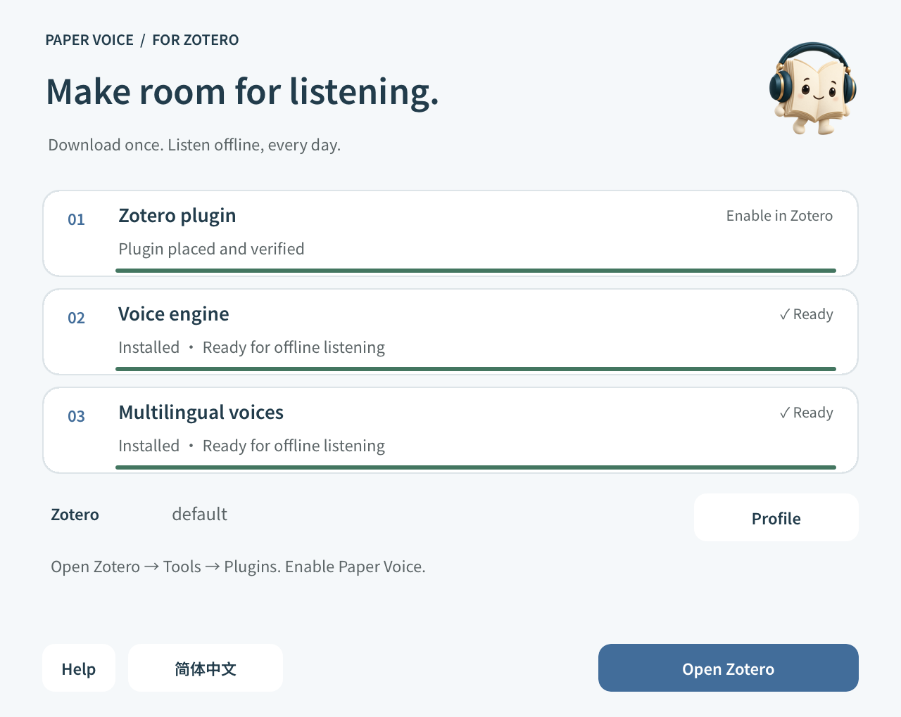

<h1 align="center">Install and update</h1>

One small installer. Download the plugin and offline voices as needed.

<a href="INSTALL.md">简体中文</a> · <b>English</b>

<a href="../README.en.md">Product home</a> · <a href="GUIDE.en.md">User guide</a> · <a href="COMPATIBILITY.en.md">Compatibility</a>

## Contents

[Download](#1-download-the-installer) · [Voices](#2-prepare-voices) · [Enable](#3-add-the-plugin-to-zotero) · [Custom locations](#zotero-in-a-custom-location) · [Voice folder](#voice-folder) · [Updates](#updating-an-existing-installation) · [Help](#installation-help) · [Uninstall](#uninstall)

## 1. Download the installer

Install and open **Zotero 10** once. Under Assets on the [official release page](https://github.com/JunyanKang/paper-voice/releases/latest), download:

<table align="center">
<thead>
<tr>
  <th align="center">Computer</th>
  <th align="center">File</th>
</tr>
</thead>
<tbody>
<tr>
  <td align="center">Windows · Intel / AMD x64</td>
  <td align="center"><code>Paper-Voice-…-Windows.exe</code></td>
</tr>
<tr>
  <td align="center">Mac · Apple Silicon · macOS 14+</td>
  <td align="center"><code>Paper-Voice-…-macOS.dmg</code></td>
</tr>
</tbody>
</table>

On Windows, run the EXE. On Mac, open the DMG, then the installer inside it. Switch English and Chinese at the bottom; no separate Python installation is needed.

**System security prompts:** the installer is not Apple Developer ID notarized or Windows Authenticode signed. On Mac, first try opening it once, then go to **System Settings → Privacy & Security → Open Anyway**. Allow it only after confirming it came from the official release page above. On Windows, verify the source too; do not disable system-wide protections.

## 2. Prepare voices

Keep the default voice folder or choose a location with enough space, then select **Download & install**. Setup creates a `paper-voice-engine` folder inside your chosen location.

Windows installer · Choose a voice location, then download the components.

The installer downloads the components for your computer and shows progress for each. The table below explains what each download provides.

<table align="center">
<thead>
<tr>
  <th align="center">Download</th>
  <th align="center">Purpose</th>
</tr>
</thead>
<tbody>
<tr>
  <td align="center">Zotero plugin</td>
  <td align="center">Reading controls, positioning and translation</td>
</tr>
<tr>
  <td align="center">Voice engine</td>
  <td align="center">Local runtime for your platform</td>
</tr>
<tr>
  <td align="center">Multilingual voices</td>
  <td align="center">English, Chinese, Japanese and French models and dictionaries</td>
</tr>
</tbody>
</table>

Progress covers download, verification, extraction and a voice check. Complete existing voices are reused; missing or damaged parts are downloaded again. Allow **3 GB** free for downloads and extraction on a first installation.

You can cancel during downloads; verified files remain for retry. Incomplete voices never replace working ones. Wait for final installation to finish before the plugin step.

## 3. Add the plugin to Zotero

Setup finds Zotero and its profiles. One profile is selected automatically; when several exist, choose the one you normally use.

1. Quit Zotero normally when prompted. Setup continues automatically.
2. Once the plugin is placed and verified, select **Open Zotero**.
3. On first installation, enable Paper Voice under **Tools → Plugins**.

Mac installer · After files are ready, enable the plugin in Zotero on first use.

**Enable in Zotero** means the file is ready but activation is not confirmed. Setup shows **Installed** only after Zotero reports an active plugin. Updates preserve the existing enabled state, settings and other plugins.

Open a PDF with selectable text to begin. [Your first reading →](GUIDE.en.md#your-first-reading)

## Zotero in a custom location

**Windows installations on D: or another custom drive are normally detected.** Setup reads the running program's path and installation records in the current-user and system registry. It also checks common system and per-user folders; C: is not required.

**Moved, portable or unregistered copies:** select **Locate Zotero** and choose `zotero.exe` in the actual installation folder; on Mac, choose `Zotero.app`. Setup verifies the application and version. You can also open Zotero so setup can find its running path, then quit normally to continue installation.

These locations serve different purposes:

<table align="center">
<thead>
<tr>
  <th align="center">Location</th>
  <th align="center">Purpose</th>
  <th align="center">What to select</th>
</tr>
</thead>
<tbody>
<tr>
  <td align="center">Zotero application</td>
  <td align="center">Launches Zotero</td>
  <td align="center"><code>zotero.exe</code> or <code>Zotero.app</code></td>
</tr>
<tr>
  <td align="center">Zotero profile</td>
  <td align="center">Plugins and preferences</td>
  <td align="center">Detected automatically; manually choose a folder with <code>prefs.js</code></td>
</tr>
<tr>
  <td align="center">Voice folder</td>
  <td align="center">Offline runtime and models</td>
  <td align="center">Default or custom <code>paper-voice-engine</code></td>
</tr>
<tr>
  <td align="center">Library folder</td>
  <td align="center">Papers and database</td>
  <td align="center">Not needed for plugin installation</td>
</tr>
</tbody>
</table>

Profile information normally lives under `%APPDATA%\Zotero\Zotero` on Windows or `~/Library/Application Support/Zotero` on Mac. Setup reads `profiles.ini`, including profiles registered on other drives. If no profile exists, open Zotero once first.

**Manual installation:** select Manual install to reveal the XPI in **Downloads → Paper Voice**, then use Zotero **Tools → Plugins → gear → Install Plugin From File**.

## Voice folder

The plugin first uses the location recorded by the installer. Without a record, it checks:

- **Mac:** `~/Library/Application Support/Zotero/paper-voice-engine`
- **Windows:** `%APPDATA%\Zotero\Zotero\paper-voice-engine`

After moving voices, click the folder icon under **Settings → Voice** and choose `paper-voice-engine` or its parent. The plugin automatically tests the current voice before saving. If the test fails, it shows a short message and keeps the previous path. **Use auto** restores automatic discovery.

Use the folder icon to locate your installed voices.

Keep external drives connected. Changing a path does not delete old voices; remove the old folder only after confirming the new location works.

## Updating an existing installation

<table align="center">
<thead>
<tr>
  <th align="center">Current installation</th>
  <th align="center">Action</th>
</tr>
</thead>
<tbody>
<tr>
  <td align="center">Plugin <strong>1.3.10 or earlier</strong></td>
  <td align="center">Run the new installer with Plugin only to migrate the update address</td>
</tr>
<tr>
  <td align="center">Voices from <strong>1.2.5 or earlier</strong></td>
  <td align="center">Use Download &amp; install once for multilingual voices</td>
</tr>
<tr>
  <td align="center">Migration already complete</td>
  <td align="center">Use Check → Install update in the plugin; no voice reinstall needed</td>
</tr>
</tbody>
</table>

The installer prompts you to quit Zotero, then installs into the selected profile. Voice locations, preferences and reading progress are stored independently.

**Two update routes:** Paper Voice settings and Zotero **Tools → Plugins → gear → Check for Updates**. Paper Voice can check daily, weekly or monthly and skip a version's reminder. Zotero's Automatic Updates setting controls its installation policy independently; choose Default or On if you want Zotero to install updates automatically.

Releases contain DMG and EXE installers only. Setup and the updater retrieve the XPI from a separate download address; `updates.json` supplies its version, URL and hash, rather than containing the plugin. Failed downloads do not remove the installed plugin.

## Installation help

**Zotero or a profile is missing** 
Open Zotero once. Use Locate Zotero for a custom program location, or Profile for a custom profile. Do not select the library storage folder.

**Download or verification fails** 
Check access to `kanglab.cool/paper-voice` (hosted by GitHub Pages), then retry. Verified files can be reused. Check available disk space.

**Windows reports a missing DLL** 
Install the [Microsoft Visual C++ x64 runtime](https://aka.ms/vs/17/release/vc_redist.x64.exe), then reopen setup.

**Installation finished but there is no sound** 
Preview a voice and check system volume and output. If voices moved or a drive disconnected, select their location again.

For unresolved issues, report the system, Zotero version, failing step and error in [Issues](https://github.com/JunyanKang/paper-voice/issues). Do not attach private libraries or unpublished papers.

## Uninstall

Disable or remove Paper Voice in Zotero's plugin manager. If no longer needed, delete the actual `paper-voice-engine` folder and `paper-voice-location.json` beside the default voice folder.

Installer caches are at `~/Library/Caches/PaperVoiceInstaller` on Mac and `%LOCALAPPDATA%\PaperVoiceInstaller` on Windows. Preferences and progress use Zotero's `extensions.paperVoice.*` settings. Papers and annotations are unaffected.

---

[Product home](../README.en.md) · [User guide](GUIDE.en.md) · [Compatibility](COMPATIBILITY.en.md) · [Privacy](../PRIVACY.en.md)
