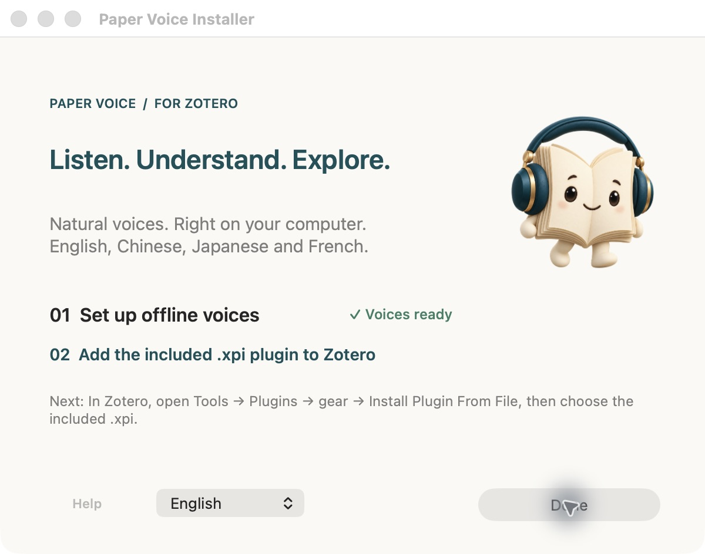

# Install Paper Voice

[Product home](../README.en.md) · [简体中文](INSTALL.md) / **English**

> Download → Set up voices → Add the plugin. Open a PDF and make room to listen.

Download the complete ZIP for your computer from [Releases](https://github.com/JunyanKang/paper-voice/releases/latest), then extract it.

**Windows · Intel / AMD x64**: Open `Paper Voice Setup.exe` after extracting the complete Windows package.

**Mac · Apple Silicon, macOS 14+**: Open `Paper Voice Installer.app` after extracting the complete Mac package.

## 1. Install offline voices

Open the installer and choose **English** or **简体中文** at the bottom of the window. The default follows your system language.

Click **Install voices**. When **✓ Voices ready** appears beside step 1, the voice setup is complete. No account, extra download or administrator password is required.

On Windows, keep the `Resources` folder beside the installer. On Mac, resources are included inside the app.

## 2. Add the plugin to Zotero

In Zotero, open **Tools → Plugins → gear → Install Plugin From File** and select the included `paper-voice-version.xpi` file.

## 3. Listen to your first passage

Open a PDF, let the plugin detect its language, and select some text. Click the floating book mascot to choose a voice or reading mode.

Explore the [user guide](../README.en.md#user-guide) for reading modes, voice choices and translation.

## Updates

**Version 1.2.6 adds Chinese, Japanese and French voices.** To use them when upgrading, download the latest complete package, run Install voices again, then update the plugin. The earlier voice pack still supports English.

Use **Check for updates** in the plugin settings, or install the latest `.xpi` through Zotero. Existing users do not need to download the full voice package again unless the release notes say otherwise.

## Installation help

**System security prompt:** The installer is not currently notarized with Apple Developer ID or signed with Windows Authenticode. Confirm that you downloaded it from this project's GitHub Releases. macOS provides the app-specific opening option in System Settings → Privacy & Security; Windows displays the source and publisher in its security prompt. You do not need to disable system-wide protection.

**Missing DLL on Windows:** Run `Resources/VC_redist.x64.exe` to install the Microsoft Visual C++ runtime, then try again.

**Missing installation files:** Extract the complete ZIP. Keep the Windows installer and its `Resources` folder together.

Downloads and plugin updates require access to GitHub. Voice synthesis works offline after installation; translation is optional and requires a network connection.

For help, open an [issue](https://github.com/JunyanKang/paper-voice/issues) with your OS version, Zotero version and the error message. Do not attach private papers or your personal Zotero database.
