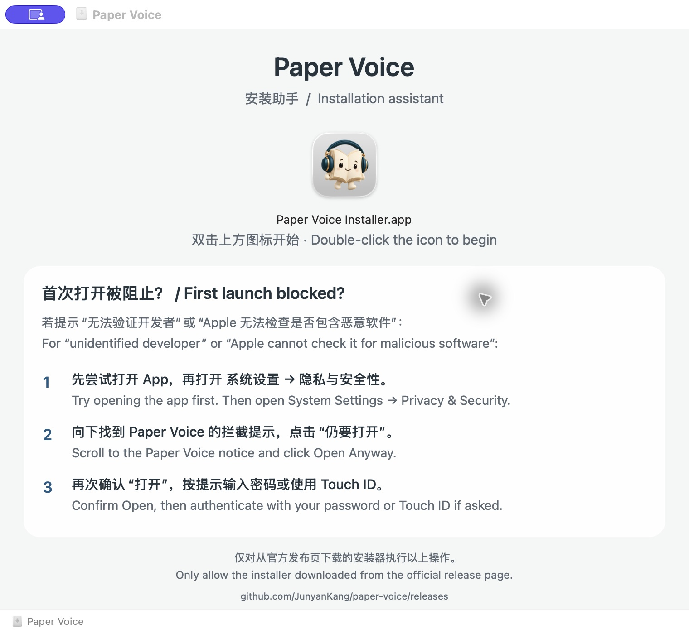
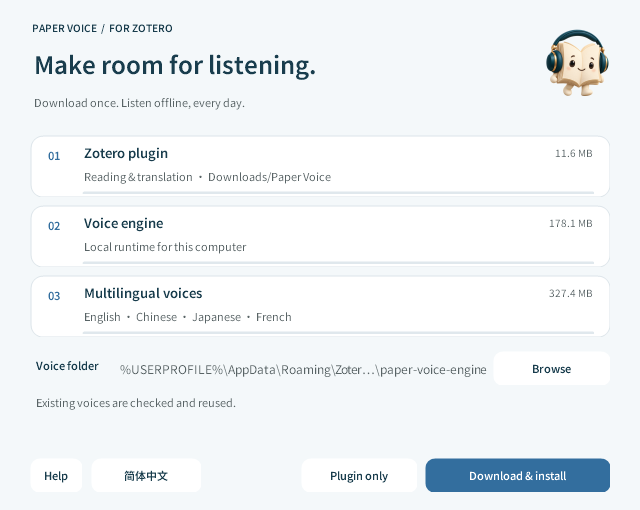
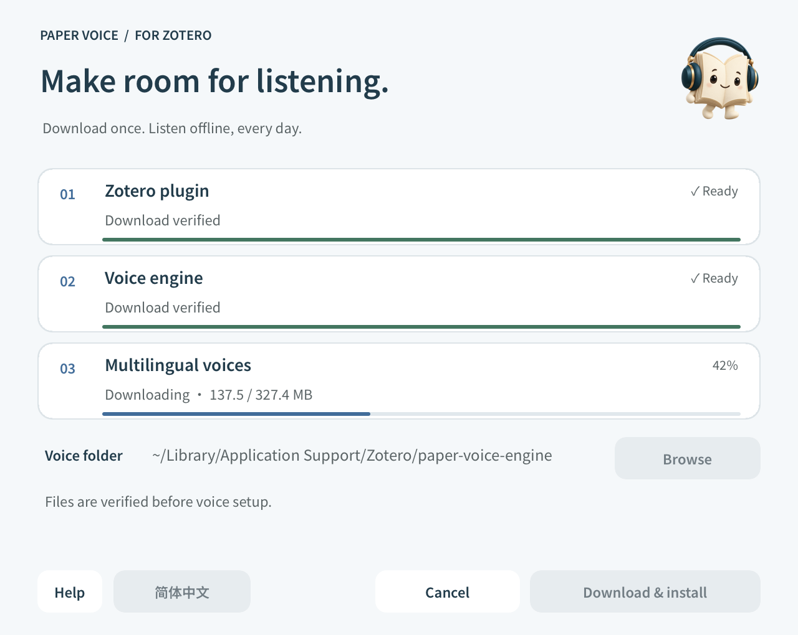

<h1 align="center">Install Paper Voice</h1>

<a href="INSTALL.md">简体中文</a> · <b>English</b>

One small installer for your plugin and offline voices.

<a href="../README.en.md">Product home</a> · <a href="GUIDE.en.md">User guide</a> · <a href="COMPATIBILITY.en.md">Compatibility</a>

## Contents

[Download](#1-download-the-installer) · [Prepare voices](#2-prepare-voices) · [Add the plugin](#3-add-the-plugin-to-zotero) · [Voice folder](#voice-folder) · [Updates](#updating-an-existing-installation) · [Help](#installation-help)

## 1. Download the installer

Install **Zotero 10** first. Choose a file under Assets on the [release page](https://github.com/JunyanKang/paper-voice/releases/latest):

| Computer | File | How to open |
|---|---|---|
| Windows · Intel / AMD x64 | `Paper-Voice-…-Windows.exe` | Double-click to run |
| Mac · Apple Silicon, macOS 14+ | `Paper-Voice-…-macOS.dmg` | Open the disk image, then its installer |

The installer contains the setup interface and download configuration. It downloads voices on first use. Switch between English and Simplified Chinese at the bottom of the window.

Mac disk image: open the installer; if blocked, verify its source and follow the three steps.

## 2. Prepare voices

Choose a **Voice folder** and select **Download & install**. The default works without adjustment; another drive is also supported. The installer creates a `paper-voice-engine` folder inside your selected location.

Help and language stay on the left; installation actions stay on the right. Cancel replaces Plugin only during download.

| Download | Purpose |
|---|---|
| Zotero plugin | Reading controls, PDF positioning and translation |
| Voice engine | Local runtime for this computer |
| Multilingual voices | English, Chinese, Japanese and French models and dictionaries |

Each item shows its size. Downloads display real percentages and transferred bytes, followed by verification, extraction and a voice check. **Voice setup is complete when the items say Installed.** Complete existing voices are verified and reused; incomplete voices are downloaded again and repaired. A first installation downloads about 530 MB on Mac or 517 MB on Windows; the installer itself is only a few MB.

Progress preview. Both platforms share the same information order and controls.

Cancel is available during downloads. Verified chunks are kept for retry, and an incomplete installation never replaces existing voices. Wait for the final setup stage to finish.

## 3. Add the plugin to Zotero

The XPI is saved in the visible **Downloads → Paper Voice** folder, outside the hidden cache. Select **Show plugin file** to reveal it. In Zotero, open:

**Tools → Plugins → gear → Install Plugin From File**

Select the downloaded `paper-voice-….xpi` and follow Zotero's prompt. The installer prepares the file; Zotero installs the plugin.

Open a PDF with selectable text and select a passage. If automatic reading is off, press Play in the selection menu.

Next: [Reading modes, voices and captions](GUIDE.en.md). Selection translation is on by default and needs internet access. Turn off Selection translation, Captions and Translated audio under **Settings → Translate** for fully offline reading.

## Voice folder

The plugin detects the location recorded by the installer. Without a record, it checks:

- Mac: `~/Library/Application Support/Zotero/paper-voice-engine`
- Windows: `%APPDATA%\Zotero\Zotero\paper-voice-engine`

To choose a location, click the folder icon beside **Settings → Voice → Voice folder**. Select `paper-voice-engine` or its parent. Paper Voice tests the current voice without playing audio, then saves the folder for your next reading session. If the test fails, a short message appears beside the icon and your previous location is kept. **Use auto** restores the installer’s saved location.

Connect an external drive before reading. If you move voices yourself, select their new location. Changing the path does not delete old voices.

## Updating an existing installation

- **Coming from 1.3.10 or earlier:** the update address has moved. Run the new installer once, select **Plugin only**, and install its downloaded XPI in Zotero. Existing multilingual voices do not need reinstalling.
- **Voices still come from 1.2.5 or earlier:** choose **Download & install** once to add Chinese, Japanese and French support.
- **After migration:** keep using **Check → Install update** in the plugin. The daily, weekly and monthly check intervals and Skip this version remain available. Voice locations, preferences and reading progress are independent of plugin updates.

Releases provide DMG and EXE installers only. The installer retrieves the XPI and voices for you. Failed updates leave the installed version usable. A failed plugin check retries once, then tries again after about 15 minutes without consuming the normal check interval.

**Zotero’s built-in updater also works.** Choose Check for Updates in Tools → Plugins → gear. Background installation follows Paper Voice’s Automatic Updates choice in Zotero; the plugin no longer overrides it. Earlier versions may have switched this off. Choose Default or On in Zotero if you want automatic installation; manual checks still work when it is off. Skip this version hides the plugin’s reminder and does not change Zotero’s installation policy.

## Installation help

**The system cannot verify the developer or publisher** 
The installer is not Apple Developer ID notarized or Windows Authenticode signed. On Mac, first try opening the installer once. If macOS blocks it, go to **System Settings → Privacy & Security → Open Anyway**. Allow it only after verifying that it came from the [official Paper Voice release page](https://github.com/JunyanKang/paper-voice/releases). On Windows, also verify the source in the security prompt. Do not disable system-wide protections.

**Windows reports a missing DLL** 
Install the [Microsoft Visual C++ x64 runtime](https://aka.ms/vs/17/release/vc_redist.x64.exe), then reopen the installer.

**A download or verification fails** 
Downloads use GitHub Pages and require access to that service. Check your connection and retry. Verified chunks are reused; damaged files are fetched again. Allow space for downloads, extraction and installation; 3 GB free is recommended for a first installation.

**Voices cannot be found** 
Check that installation completed, or choose the voice folder again in Settings. Reconnect an external drive if needed. The plugin does not modify PDFs or your library.

See [Compatibility](COMPATIBILITY.en.md) for support details. For help, report your operating system, Zotero version and error message in [Issues](https://github.com/JunyanKang/paper-voice/issues). Do not attach unpublished papers or a private library.

## Uninstall

Disable or remove Paper Voice in Zotero's plugin manager. If voices are no longer needed, delete the actual `paper-voice-engine` folder. You may also remove `paper-voice-location.json` beside the default voice folder. Download caches live at `~/Library/Caches/PaperVoiceInstaller` on Mac and `%LOCALAPPDATA%\PaperVoiceInstaller` on Windows.

Preferences and reading progress use Zotero's `extensions.paperVoice.*` preferences. Papers and annotations are unaffected.

---

[Product home](../README.en.md) · [User guide](GUIDE.en.md) · [Compatibility](COMPATIBILITY.en.md) · [Privacy](../PRIVACY.en.md)
