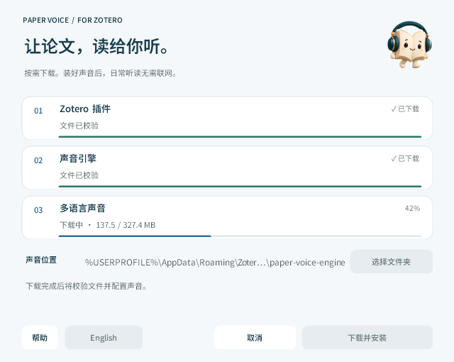

<h1 align="center">安装 Paper Voice</h1>

<b>简体中文</b> · <a href="INSTALL.en.md">English</a>

一个轻量安装器，准备好插件与离线声音。

<a href="../README.md">产品首页</a> · <a href="GUIDE.md">使用指南</a> · <a href="COMPATIBILITY.md">兼容性</a>

## 目录

[下载安装器](#1-下载安装器) · [准备声音](#2-准备声音) · [添加插件](#3-添加到-zotero) · [声音位置](#声音位置) · [升级](#更新已有插件) · [安装帮助](#安装遇到问题)

## 1. 下载安装器

先安装 **Zotero 10**。在 [发布页](https://github.com/JunyanKang/paper-voice/releases/latest) 的 Assets 中选择：

| 电脑 | 文件 | 打开方式 |
|---|---|---|
| Windows · Intel / AMD x64 | `Paper-Voice-…-Windows.exe` | 双击运行 |
| Mac · M 系列，macOS 14+ | `Paper-Voice-…-macOS.dmg` | 打开磁盘映像，再打开其中的安装助手 |

安装器只包含安装界面与下载配置；首次使用会联网下载声音。窗口底部可以切换简体中文／English。

## 2. 准备声音

选择 **声音位置**，点击 **下载并安装**。默认位置无需修改，也可选择其他磁盘。安装器会在所选文件夹内创建 `paper-voice-engine`。

左侧为帮助和语言，右侧为安装操作。下载时「取消」替换「仅更新插件」，位置保持不变。

| 下载项目 | 用途 |
|---|---|
| Zotero 插件 | 阅读控制、PDF 定位与翻译功能 |
| 声音引擎 | 当前电脑所需的本地运行环境 |
| 多语言声音 | 英语、中文、日语、法语的声音模型与词典 |

每项显示下载大小；下载中显示实际百分比与已下载字节，随后依次校验、解压并验证声音。**只有出现「声音已安装」后才算完成声音准备。** 已有完整声音会先校验并复用；不完整时会重新下载修复。首次下载约 530 MB（Mac）或 517 MB（Windows），安装器本身只有几 MB。

进度展示示例。两平台使用相同的信息顺序、按钮布局与操作逻辑。

下载中可以取消，已校验的下载分块保留供重试；原有声音不会被未完成的安装替换。最后配置阶段请等待完成。

## 3. 添加到 Zotero

插件文件保存在可直接浏览的 **下载 → Paper Voice** 文件夹，不放在隐藏的缓存目录。点击 **查看插件文件** 即可定位。在 Zotero 中选择：

**工具 → 插件 → 右上角齿轮 → 从文件安装插件**

英文界面为 **Tools → Plugins → Install Plugin From File**。选择刚下载的 `paper-voice-….xpi` 文件，按 Zotero 提示完成安装。安装器准备文件，插件仍由 Zotero 安装。

打开可选中文字的 PDF，划选正文即可开始。关闭了自动朗读时，请点击选区菜单的播放按钮。

下一步：[四种阅读模式、声音与随行译文](GUIDE.md)。划词翻译默认开启，需要联网；在 **设置 → 译文** 关闭划词翻译、显示译文和朗读译文后，可完全离线听读。

## 声音位置

插件会自动查找安装器记录的位置；没有记录时，查找以下默认文件夹：

- Mac：`~/Library/Application Support/Zotero/paper-voice-engine`
- Windows：`%APPDATA%\Zotero\Zotero\paper-voice-engine`

需要人工指定时，打开 **设置 → 声音 → 声音位置**，点击文件夹按钮，选择 `paper-voice-engine` 或它的上一级文件夹。只有包含完整声音的目录才会被接受。手动指定优先于自动识别；点击旁边的恢复按钮即可重新跟随安装器记录。更改在下次开始朗读时生效。

如果声音位于移动硬盘，请先连接硬盘再开始朗读。只移动文件夹不会自动更新位置，需重新指定。更换路径不会删除旧声音。

## 更新已有插件

- **从 1.3.10 及更早版本升级**：旧更新地址已迁移。运行新版安装器一次，选择 **仅更新插件**，再在 Zotero 中安装下载好的 XPI。已有多语言声音无需重装。
- **声音仍来自 1.2.5 及更早版本**：选择 **下载并安装**，更新一次离线声音，才能使用中、日、法文朗读。
- **完成迁移后**：继续使用插件内 **检查更新 → 安装更新**。自动检查的 1 天／1 周／1 月周期及「忽略此版本」仍然保留；声音位置、个人设置与阅读进度独立于插件更新。

发布页只提供 DMG 和 EXE。XPI 与声音由安装器获取，不必自行寻找多个文件。更新失败时，现有版本仍可继续使用。插件内检查失败会重试一次，仍失败时保留原检查周期，约 15 分钟后再次尝试。

**Zotero 自带更新也可使用。** 在「工具 → 插件」的齿轮菜单选择「检查更新」。后台自动安装由 Zotero 中 Paper Voice 的「自动更新」选项决定，新版不会覆盖该选择。旧版可能将此项设为了关闭，需要自动安装时请在 Zotero 中改为「默认」或「开启」；手动检查不受影响。插件的「忽略此版本」只隐藏本插件的提醒，不改变 Zotero 的自动安装策略。

## 安装遇到问题

**系统提示无法验证开发者或发行者** 
当前安装器未使用 Apple Developer ID 公证或 Windows Authenticode 证书。确认来自本项目 GitHub Releases 后，可在 macOS「系统设置 → 隐私与安全性」查看允许打开选项，或在 Windows 安全提示中核对来源。无需关闭全局系统保护。

**Windows 提示缺少 DLL** 
安装 [Microsoft Visual C++ x64 运行库](https://aka.ms/vs/17/release/vc_redist.x64.exe)，再运行安装器。

**下载失败或文件校验失败** 
下载由 GitHub Pages 提供，需要能够访问该服务。检查网络后点击重试；已校验的分块会继续使用，损坏的文件会重新获取。安装器需要为下载、解压和安装保留足够空间；首次安装建议预留 3 GB。

**找不到声音** 
确认安装已完成，或到声音设置重新选择声音文件夹。移动硬盘暂未连接时，先恢复连接。插件不会改写 PDF 或文献库。

更多范围见 [兼容性](COMPATIBILITY.md)。需要帮助时，可到 [Issues](https://github.com/JunyanKang/paper-voice/issues) 提供系统版本、Zotero 版本和错误提示；请勿附带未公开论文或个人资料库。

## 卸载

在 Zotero 插件管理器中停用或移除 Paper Voice。若不再需要声音，可删除实际使用的 `paper-voice-engine` 文件夹。自动发现记录是默认目录旁的 `paper-voice-location.json`，也可删除。下载缓存位于 Mac 的 `~/Library/Caches/PaperVoiceInstaller` 或 Windows 的 `%LOCALAPPDATA%\PaperVoiceInstaller`。

个人设置和阅读进度保存在 Zotero 偏好设置的 `extensions.paperVoice.*` 下。文献和批注不受影响。

---

[产品首页](../README.md) · [使用指南](GUIDE.md) · [兼容性](COMPATIBILITY.md) · [隐私说明](../PRIVACY.md)
