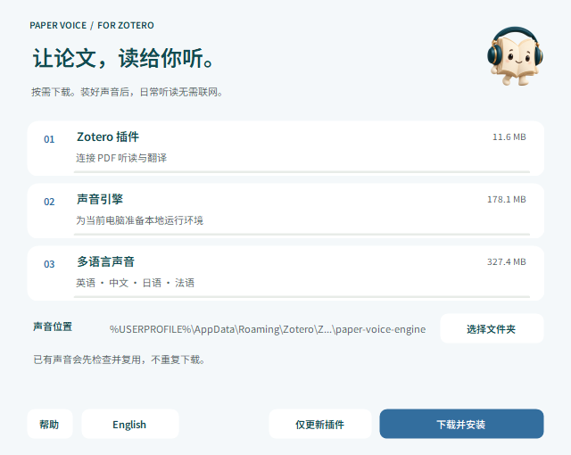
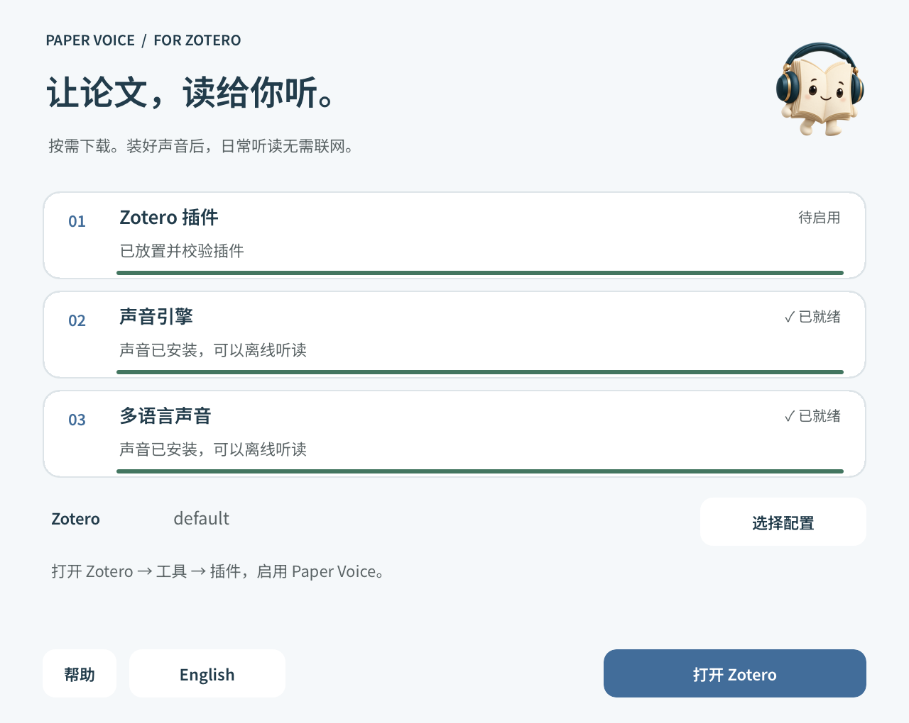

<h1 align="center">安装与升级</h1>

下载一次安装器，按需准备插件与离线声音。

<b>简体中文</b> · <a href="INSTALL.en.md">English</a>

<a href="../README.md">产品首页</a> · <a href="GUIDE.md">使用指南</a> · <a href="COMPATIBILITY.md">兼容性</a>

## 目录

[下载安装](#1-下载安装器) · [准备声音](#2-准备离线声音) · [启用插件](#3-在-zotero-启用插件) · [自定义路径](#zotero-安装在其他位置) · [声音位置](#声音位置) · [更新](#更新已有插件) · [排障](#安装遇到问题) · [卸载](#卸载)

## 1. 下载安装器

先安装并打开 **Zotero 10** 一次。到 [官方发布页](https://github.com/JunyanKang/paper-voice/releases/latest) 的 Assets 下载对应文件：

<table align="center">
<thead>
<tr>
  <th align="center">电脑</th>
  <th align="center">安装文件</th>
</tr>
</thead>
<tbody>
<tr>
  <td align="center">Windows · Intel / AMD x64</td>
  <td align="center"><code>Paper-Voice-…-Windows.exe</code></td>
</tr>
<tr>
  <td align="center">Mac · Apple 芯片 · macOS 14+</td>
  <td align="center"><code>Paper-Voice-…-macOS.dmg</code></td>
</tr>
</tbody>
</table>

Windows 双击 EXE；Mac 打开 DMG 后，再打开其中的安装器。底部可切换中文和英文，无需另装 Python。

**遇到系统安全提示：** 当前安装器未进行 Apple Developer ID 公证或 Windows Authenticode 签名。Mac 请先尝试打开一次，再到 **系统设置 → 隐私与安全性 → 仍要打开**；仅在确认文件来自上方官方发布页时允许运行。Windows 同样先核对发布来源，无需关闭系统安全防护。

## 2. 准备离线声音

使用默认声音位置，或选择有足够空间的目录，然后点击 **下载并安装**。安装器会在所选位置创建 `paper-voice-engine` 文件夹。

Windows 安装器 · 选择声音位置，再下载所需组件。

安装器会根据电脑平台下载所需组件，并分别显示进度。下面是各项下载的用途。

<table align="center">
<thead>
<tr>
  <th align="center">下载项目</th>
  <th align="center">用途</th>
</tr>
</thead>
<tbody>
<tr>
  <td align="center">Zotero 插件</td>
  <td align="center">阅读控制、定位与翻译</td>
</tr>
<tr>
  <td align="center">声音引擎</td>
  <td align="center">当前平台的本地运行环境</td>
</tr>
<tr>
  <td align="center">多语言声音</td>
  <td align="center">中、英、日、法语音模型与词典</td>
</tr>
</tbody>
</table>

进度会依次显示下载、校验、解压和声音测试。已有完整声音会复用；损坏或缺失部分会重新下载。首次安装建议预留 **3 GB** 空间，以容纳下载和解压文件。

下载阶段可取消，已校验的文件保留供重试；未完成的声音不会覆盖原有可用声音。声音安装完成后，按提示安装 Zotero 插件。

## 3. 在 Zotero 启用插件

安装器自动查找 Zotero 和用户配置。只有一个配置时直接使用；多个配置时，选择日常使用的那个。

1. Zotero 正在运行时，按提示正常退出，安装器会自动继续。
2. 插件放置并校验完成后，点击 **打开 Zotero**。
3. 首次安装，在 **工具 → 插件** 中启用 Paper Voice。

Mac 安装器 · 文件准备完毕后，首次仍需在 Zotero 中启用插件。

「待启用」表示文件已准备好，但尚未确认启用；只有 Zotero 报告插件处于启用状态后，才显示「已安装」。更新保留原有启用状态、设置及其他插件。

打开可选中文字的 PDF，就可以开始听读。[第一次使用 →](GUIDE.md#开始第一次听读)

## Zotero 安装在其他位置

**Windows 装在 D 盘或自定义目录通常可直接识别。** 安装器读取运行中的 Zotero 路径，以及当前用户／系统注册表中的安装记录，不要求程序位于 C 盘。也会检查常见的系统与用户级安装目录。

**移动过目录、便携版或注册信息缺失：** 点击 **选择 Zotero**，选中实际程序目录中的 `zotero.exe`；Mac 选择 `Zotero.app`。安装器会验证应用及版本。无法识别时也可先打开 Zotero，让安装器从运行中的程序获取位置，再正常退出后继续。

这几个路径用途不同，请勿混淆：

<table align="center">
<thead>
<tr>
  <th align="center">位置</th>
  <th align="center">用途</th>
  <th align="center">如何选择</th>
</tr>
</thead>
<tbody>
<tr>
  <td align="center">Zotero 程序目录</td>
  <td align="center">启动 Zotero</td>
  <td align="center">选择 <code>zotero.exe</code> 或 <code>Zotero.app</code></td>
</tr>
<tr>
  <td align="center">Zotero 用户配置</td>
  <td align="center">存放插件与偏好设置</td>
  <td align="center">自动识别，多个时选择；手动选含 <code>prefs.js</code> 的目录</td>
</tr>
<tr>
  <td align="center">声音目录</td>
  <td align="center">存放离线引擎与模型</td>
  <td align="center">默认或自定义 <code>paper-voice-engine</code></td>
</tr>
<tr>
  <td align="center">文献库目录</td>
  <td align="center">保存论文与数据库</td>
  <td align="center">无需选择，安装器不向这里安装插件</td>
</tr>
</tbody>
</table>

配置通常位于 Windows 的 `%APPDATA%\Zotero\Zotero` 或 Mac 的 `~/Library/Application Support/Zotero` 下；安装器根据 `profiles.ini` 查找真实位置，也支持其中登记在其他磁盘的配置。首次使用还没有配置时，先打开一次 Zotero。

**手动安装：** 点击「手动安装」，在 **下载 → Paper Voice** 找到 XPI，再在 Zotero **工具 → 插件 → 齿轮 → 从文件安装插件** 中选择它。

## 声音位置

插件优先读取安装器记录的声音位置；没有记录时检查默认目录：

- **Mac：** `~/Library/Application Support/Zotero/paper-voice-engine`
- **Windows：** `%APPDATA%\Zotero\Zotero\paper-voice-engine`

迁移声音后，在 **设置 → 声音** 点击文件夹图标，选择 `paper-voice-engine` 或其父目录。插件会自动测试当前声音，通过后保存；失败时给出简短提示，并保留原位置。手动指定后可「恢复自动」。

声音设置中的文件夹图标用于选择实际声音位置。

外接磁盘需保持连接。改变路径不会删除旧声音；迁移完成并确认可用后，再自行清理旧目录。

## 更新已有插件

<table align="center">
<thead>
<tr>
  <th align="center">当前情况</th>
  <th align="center">操作</th>
</tr>
</thead>
<tbody>
<tr>
  <td align="center">插件为 <strong>1.3.10 及更早版本</strong></td>
  <td align="center">运行新版安装器，选「仅更新插件」，迁移更新地址</td>
</tr>
<tr>
  <td align="center">声音来自 <strong>1.2.5 及更早版本</strong></td>
  <td align="center">选「下载并安装」，一次更新多语言声音</td>
</tr>
<tr>
  <td align="center">已完成上述迁移</td>
  <td align="center">在插件中「检查更新 → 安装更新」，无需重装声音</td>
</tr>
</tbody>
</table>

安装器更新插件时同样会提示退出 Zotero，再自动安装到所选配置。声音位置、个人设置与阅读进度独立保存。

**两种更新入口：** Paper Voice 设置中的检查更新，以及 Zotero「工具 → 插件 → 齿轮 → 检查更新」。插件可按天、周或月提醒，也可忽略一个版本；Zotero 的自动安装策略由插件管理器中的「自动更新」决定，二者互不替代。若希望 Zotero 自动安装，请将其设为默认或开启。

发布页仅提供 DMG 和 EXE。安装器与更新器从独立下载地址获取 XPI；`updates.json` 提供版本、下载链接和校验信息，本身不是插件文件。下载失败不会移除现有插件。

## 安装遇到问题

**没有找到 Zotero 或配置** 
先打开 Zotero 一次；自定义程序位置用「选择 Zotero」，自定义配置用「选择配置」。不要选择文献库存储目录。

**下载或校验失败** 
确认网络可访问下载服务（`kanglab.cool/paper-voice`，由 GitHub Pages 托管），再重试。已校验文件可复用；确保有足够磁盘空间。

**Windows 提示缺少 DLL** 
安装 [Microsoft Visual C++ x64 运行库](https://aka.ms/vs/17/release/vc_redist.x64.exe)，再打开安装器。

**安装完成却没有声音** 
先在声音设置中试听，检查音量与输出设备。声音目录移动过或磁盘未连接时，重新指定位置。

仍有问题时，在 [Issues](https://github.com/JunyanKang/paper-voice/issues) 提供系统、Zotero 版本、失败步骤与错误提示。不要附上私人文献库或未发表论文。

## 卸载

在 Zotero 插件管理器停用或移除 Paper Voice。不再需要声音时，可删除实际的 `paper-voice-engine` 目录，以及默认声音目录旁的 `paper-voice-location.json`。

安装器缓存位于 Mac 的 `~/Library/Caches/PaperVoiceInstaller` 或 Windows 的 `%LOCALAPPDATA%\PaperVoiceInstaller`。偏好与进度使用 Zotero 的 `extensions.paperVoice.*` 设置；论文和批注不受影响。

---

[产品首页](../README.md) · [使用指南](GUIDE.md) · [兼容性](COMPATIBILITY.md) · [隐私](../PRIVACY.md)
