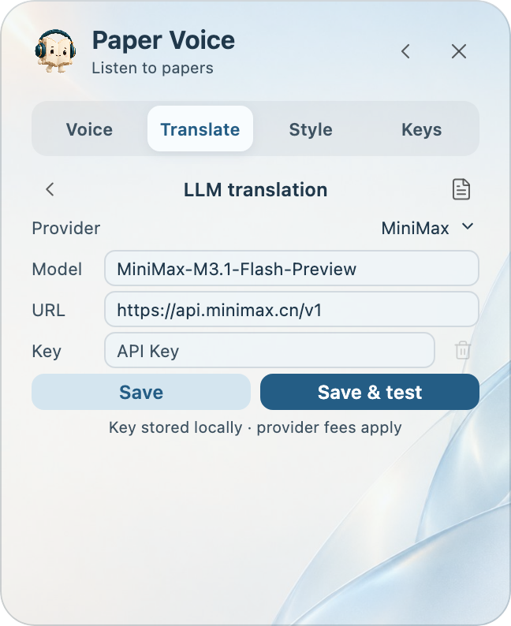

<h1 align="center">Translation guide</h1>

Choose a translation service, then decide what to see and hear.

<a href="TRANSLATION.md">简体中文</a> · <b>English</b>

## Choose a service

Under **Settings → Translate**, select Tencent, Microsoft or Google for a public translation service. Tencent is the default; Microsoft and Google also support Traditional Chinese. Availability depends on your network and the service's limits. No API key is required for these options.

Choose **LLM · API** to use your own model. This is optional; the plugin does not include API credits or automatically switch to another paid provider.

## Choose what to translate

<table align="center">
<thead>
<tr>
  <th align="center">Option</th>
  <th align="center">What it does</th>
</tr>
</thead>
<tbody>
<tr>
  <td align="center">Selection translation</td>
  <td align="center">Shows a translation near your selection; scope can be selection, sentence or paragraph</td>
</tr>
<tr>
  <td align="center">Captions</td>
  <td align="center">Shows the current sentence's translation while listening</td>
</tr>
<tr>
  <td align="center">Translated audio</td>
  <td align="center">Plays only the translation while highlighting the original</td>
</tr>
</tbody>
</table>

Caption targets include Simplified and Traditional Chinese, English, Japanese, French, German, Spanish, Korean and Russian. Offline audio is available for English, Chinese, Japanese and French. Interface language is a separate setting.

Choose a service, target language and caption font.

## LLM translation

To translate with your own model, choose **Settings → Translate → Service → LLM · API**. The free Tencent, Microsoft and Google services remain available without an API key.

Use your own API key, then save and test the connection.

### Connect in three steps

1. **Choose a provider.** Presets include MiniMax, DeepSeek, Qwen, Doubao, GLM, Kimi, Hunyuan, Qianfan, OpenAI, Claude and Gemini, plus a custom OpenAI-compatible endpoint.
2. **Enter your API key.** Get the key from the provider’s console. Presets fill the API URL and a suggested model; edit either for your region or account. Some services, including Doubao, require the model or endpoint ID shown in their console.
3. **Select Save & test.** The plugin translates a sample sentence and displays the connection status and completion time. Hover over a successful result to see the sample translation. Once saved, selection translation, captions and translated audio all use this service.

Translations appear progressively and are cached. Results from an older scope cannot overwrite a newer selection. First calls, long text, reasoning and network conditions affect the wait; a Flash or fast model is often a better choice for reading.

### Keys and costs

- Keys stay in the encrypted login store of the current Zotero profile. A saved key is never restored into the input. Leave it blank to keep the saved key, or select the trash icon to remove it.
- Only the chosen text, target language and translation instructions go to your API. The PDF file, annotations and library are not uploaded. Continuous translation may prefetch the next sentence.
- This is optional. Billing, subscription quotas and model access belong to the provider; app subscriptions and API access may differ. Use a key supported by your chosen endpoint.
- For access errors, check your key and plan. For quota errors, wait or switch to a free service. For an unknown model, check its exact ID in the console. Paper Voice never switches automatically to another paid provider.

Domestic APIs can be configured for mainland China without routing through an overseas service. Availability of international APIs depends on your network and the provider’s regional requirements. Verify technical terms, numbers and important conclusions against the original text.

## If translation fails

Check the network, target language and selected service. For an API, check the model name, endpoint, key permissions and available balance, then select **Save & test**. Its sample result and elapsed time help you assess the connection. App subscriptions do not always include API access.

For private or unpublished text, review your provider's data policy before enabling translation. For fully offline reading, turn off Selection translation, Captions and Translated audio. [Privacy](../PRIVACY.en.md)

---

[Product home](../README.en.md) · [User guide](GUIDE.en.md) · [Installation](INSTALL.en.md)
